# AI Rent

AI Rent is an **AI-powered smart rental platform** that allows users to **list, discover, request, rent, return, and review items** through one unified system. The platform is designed for multiple rental categories such as **vehicles, electronics, tools, and apartments**, with a focus on smarter discovery, secure workflows, and a more sustainable sharing economy.

## Project Overview

AI Rent is built as a cross-platform rental marketplace where:

- **Renters** can browse listings, search and filter items, request rentals, add products to their wishlist, and leave reviews after completed rentals.
- **Owners** can create and manage listings, upload images, approve or reject rental requests, and manage rental states.
- **Admins** can moderate listings, manage users and categories, inspect rentals, and monitor the system.

The platform also includes an **AI recommendation engine** that learns from user behavior such as views, searches, wishlists, rentals, and reviews to provide personalized recommendations and similar-item suggestions.

## Tech Stack

### Mobile Application
- Flutter

### Backend API
- Node.js
- Express.js

### Database
- PostgreSQL
- Prisma ORM

### Authentication & Security
- JWT
- bcrypt

### AI Service
- Python
- Flask

### Storage & Notifications
- Cloudinary or AWS S3
- Firebase Cloud Messaging (FCM)

### Deployment & Version Control
- Docker
- Render or Railway
- Git & GitHub

## Core Features

- User registration, login, logout, refresh token rotation, and profile management
- Role-based access control for **Renter**, **Owner**, and **Admin**
- Product listing management with multiple images
- Category management
- Product browsing, keyword search, filtering, sorting, and pagination
- Rental request workflow with approval, rejection, availability checks, and lifecycle tracking
- Ratings and reviews after completed rentals
- Wishlist / favorites
- Notifications system
- Admin dashboard and moderation endpoints
- AI recommendations for home feed and similar products
- Dockerized deployment and API documentation

## User Roles

### Guest
- Register and log in
- Browse public listings
- View categories

### Renter
- Search and filter products
- Add products to wishlist
- Request rentals
- Cancel eligible bookings
- Review completed rentals

### Owner
- Create, edit, and delete listings
- Upload listing images
- Approve or reject rental requests
- Mark rental states

### Admin
- Manage users
- Manage listings
- Manage categories
- Inspect rentals
- Review reports and moderate platform activity

## High-Level Architecture

The project follows a **client-server architecture** with a **modular backend** and a separate **AI microservice**.

```text
Flutter Mobile App  <----HTTPS / JSON---->  Node.js / Express API
                                                |
                                                |---- PostgreSQL
                                                |---- Image Storage
                                                |---- FCM / Email
                                                |
                                                |---- Python Flask AI Service
```

### Backend Layering

```text
Routes -> Controllers -> Services -> Repositories -> Database
                                     -> External Services
```

This structure helps keep the system maintainable, scalable, and easier to test.

## Main Modules

- **Authentication & User Profile**
- **Product Listing Management**
- **Search, Browse, and Filter**
- **Rental and Booking Workflow**
- **Review and Rating System**
- **Wishlist Module**
- **Notification Module**
- **Admin Module**
- **AI Recommendation Module**

## Rental Workflow

1. Renter opens a product detail page
2. Renter selects rental dates
3. Backend checks availability and overlapping rentals
4. Renter submits rental request
5. Owner receives a notification
6. Owner approves or rejects the request
7. If approved, the dates become reserved
8. Owner marks the rental as active when it starts
9. Owner marks the rental as completed after return
10. Renter becomes eligible to leave a rating and review

## API Overview

Base URL:

```text
/api/v1
```

Main endpoint groups:

- `auth`
- `users`
- `products`
- `categories`
- `rentals`
- `reviews`
- `wishlists`
- `recommendations`
- `behavior`
- `notifications`
- `admin`

## AI Recommendation Engine

The recommendation engine is designed to improve discovery and conversion using:

- **Content-based filtering**
- **Collaborative filtering**
- **Hybrid recommendation scoring**

It uses behavior signals such as:

- Product views
- Search events
- Wishlist additions
- Completed rentals
- Reviews
- Recommendation clicks

## Suggested Project Structure

```text
src/
  app.js
  server.js
  config/
  routes/
  controllers/
  services/
  repositories/
  middlewares/
  validators/
  utils/
  modules/
    auth/
    users/
    categories/
    products/
    rentals/
    reviews/
    wishlists/
    notifications/
    admin/
    recommendations/
prisma/
tests/
```

## Environment Variables

Create a `.env` file and add your environment variables.

Example:

```env
DATABASE_URL=
JWT_ACCESS_SECRET=
JWT_REFRESH_SECRET=
ACCESS_TOKEN_EXPIRES_IN=
REFRESH_TOKEN_EXPIRES_IN=
CLOUDINARY_URL=
FCM_SERVER_KEY=
AI_SERVICE_URL=
PORT=
NODE_ENV=
```

> Do not commit your real `.env` file to GitHub.

## Development Plan

Suggested implementation order:

1. Authentication and user module
2. Categories and products
3. Media upload
4. Search and filtering
5. Rentals and availability
6. Notifications
7. Reviews and wishlist
8. Admin tools
9. AI recommendation service
10. Deployment and quality assurance

## Testing

Recommended testing tools:

- Jest
- Supertest
- Postman or Bruno
- Flutter widget and integration tests
- pytest for the Flask AI service

## Future Enhancements

- Online payment gateway
- Real-time chat between renter and owner
- Map-based discovery
- Identity verification and trust scores
- Delivery tracking
- Insurance and damage claim workflow
- Advanced analytics dashboard
- Multilingual support
- Demand-based pricing
- Stronger machine learning models

## Documentation

This README was prepared from the project documentation and refined project specification.

## Author

Add your name here.

## License

This project is for academic / graduation project purposes.
# AI Rent — UML & Architecture Diagrams.

## 1) Use Case Diagram

```mermaid
flowchart LR
  %% Actors
  Guest([Guest])
  Renter([Renter])
  Owner([Owner])
  Admin([Admin])

  subgraph System[AI RENT SYSTEM]
    direction LR

    subgraph Auth[Authentication]
      UC_Register((Register))
      UC_Login((Login))
      UC_Forgot((Forgot Password))
      UC_Reset((Reset Password))
    end

    subgraph RenterFeatures[Renter Features]
      UC_Browse((Browse Listings))
      UC_Search((Search & Filter))
      UC_View((View Product Details))
      UC_Request((Request Rental))
      UC_Cancel((Cancel Booking))
      UC_MyBookings((View My Bookings))
      UC_Rate((Rate & Review))
      UC_Wishlist((Manage Wishlist))
      UC_Recommendations((View Recommendations))
      UC_RenterNotif((View Notifications))
      UC_EditProfileR((Edit Profile))
    end

    subgraph OwnerFeatures[Owner Features]
      UC_CreateListing((Create Listing))
      UC_EditListing((Edit Listing))
      UC_DeleteListing((Delete Listing))
      UC_UploadImages((Upload Product Images))
      UC_Pricing((Set Pricing Tiers))
      UC_UpdateStatus((Update Listing Status))
      UC_ViewRequests((View Rental Requests))
      UC_Approve((Approve Rental))
      UC_Reject((Reject Rental))
      UC_Start((Mark Rental Started))
      UC_Complete((Mark Rental Completed))
      UC_ReplyReview((Reply to Review))
      UC_OwnerNotif((View Notifications))
      UC_EditProfileO((Edit Profile))
    end

    subgraph AdminFeatures[Admin Features]
      UC_Dashboard((View Dashboard))
      UC_ManageUsers((Manage Users))
      UC_Activate((Activate/Suspend User))
      UC_Categories((Manage Categories))
      UC_ApproveListing((Approve Listing))
      UC_RejectListing((Reject Listing))
      UC_AllRentals((View All Rentals))
      UC_Reports((View System Reports))
      UC_ManageAllListings((Manage All Listings))
    end

    subgraph SystemAuto["SYSTEM - Automated"]
      UC_GenRecs((Generate Recommendations))
      UC_Track((Track User Behavior))
      UC_SendNotif((Send Notifications))
      UC_CalcPrice((Calculate Rental Price))
      UC_CheckAvail((Check Availability))
      UC_UpdateAvail((Update Listing Availability))
      UC_ComputeRating((Compute Average Rating))
    end
  end

  %% Associations
  Guest --- UC_Register
  Guest --- UC_Login
  Renter --- UC_Browse
  Renter --- UC_Search
  Renter --- UC_View
  Renter --- UC_Request
  Renter --- UC_Cancel
  Renter --- UC_MyBookings
  Renter --- UC_Rate
  Renter --- UC_Wishlist
  Renter --- UC_Recommendations
  Renter --- UC_RenterNotif
  Renter --- UC_EditProfileR

  Owner --- UC_CreateListing
  Owner --- UC_EditListing
  Owner --- UC_DeleteListing
  Owner --- UC_UploadImages
  Owner --- UC_Pricing
  Owner --- UC_UpdateStatus
  Owner --- UC_ViewRequests
  Owner --- UC_Approve
  Owner --- UC_Reject
  Owner --- UC_Start
  Owner --- UC_Complete
  Owner --- UC_ReplyReview
  Owner --- UC_OwnerNotif
  Owner --- UC_EditProfileO

  Admin --- UC_Dashboard
  Admin --- UC_ManageUsers
  Admin --- UC_Activate
  Admin --- UC_Categories
  Admin --- UC_ApproveListing
  Admin --- UC_RejectListing
  Admin --- UC_AllRentals
  Admin --- UC_Reports
  Admin --- UC_ManageAllListings
```

---

## 2) Class Diagram

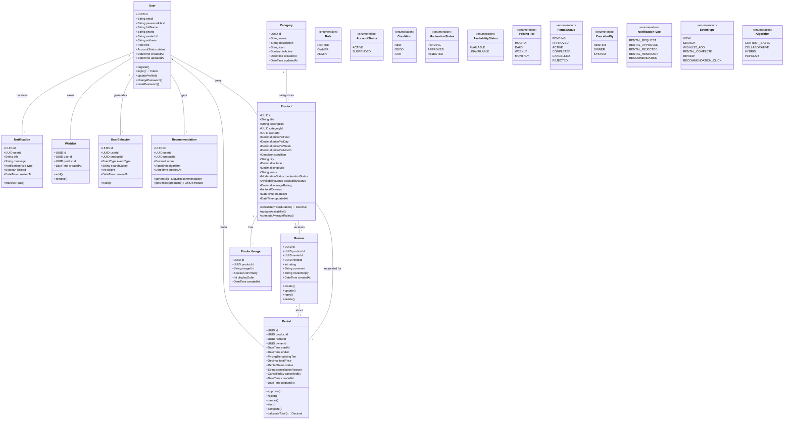

---

## 3) Sequence Diagrams

### 3.1 User Registration

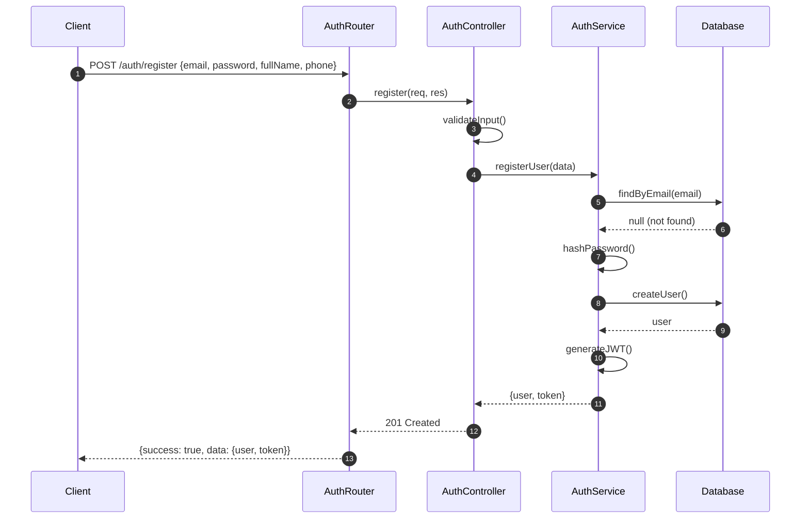

### 3.2 Rental Booking Flow

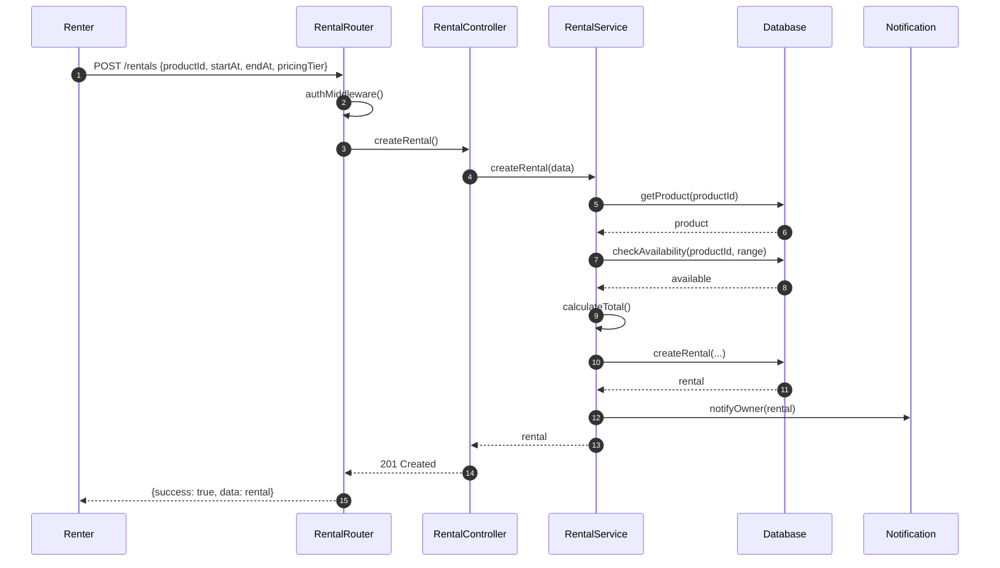

### 3.3 AI Recommendation Flow

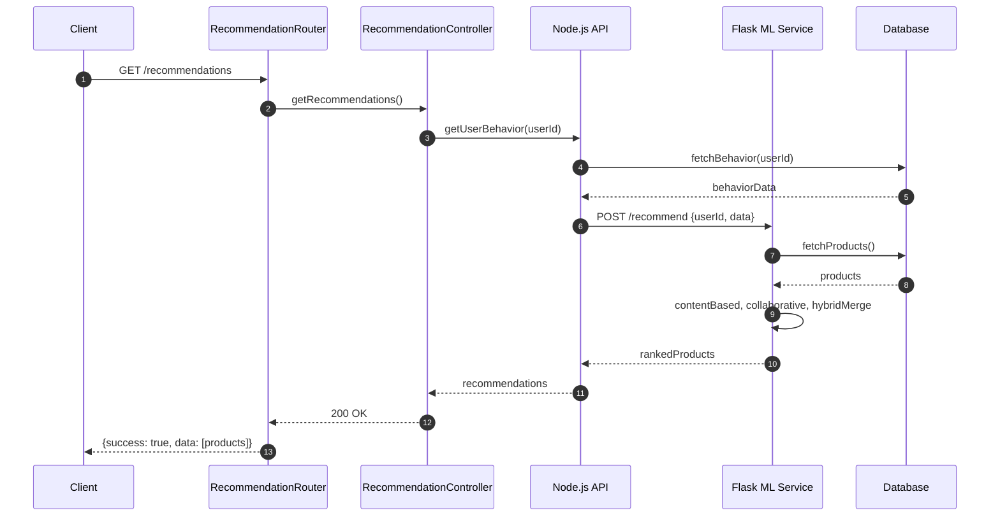

### 3.4 Owner Approves Rental

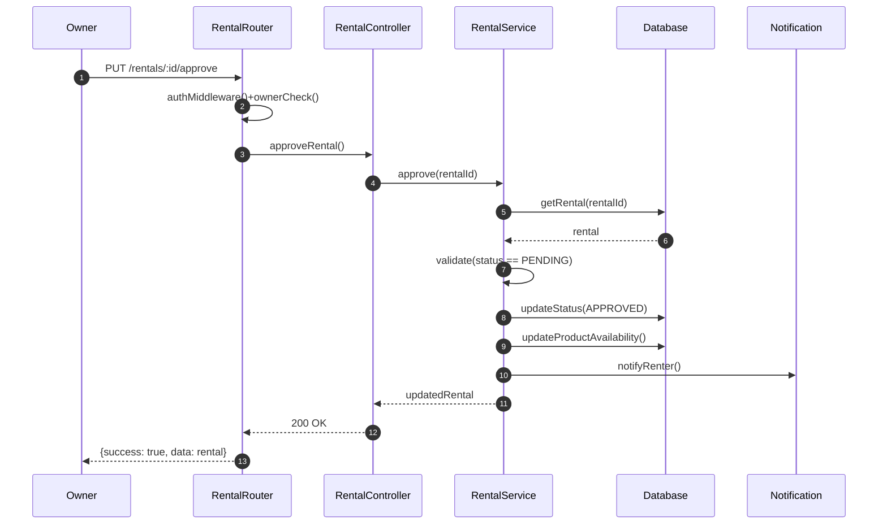

---

## 4) Activity Diagrams

### 4.1 Rental Lifecycle

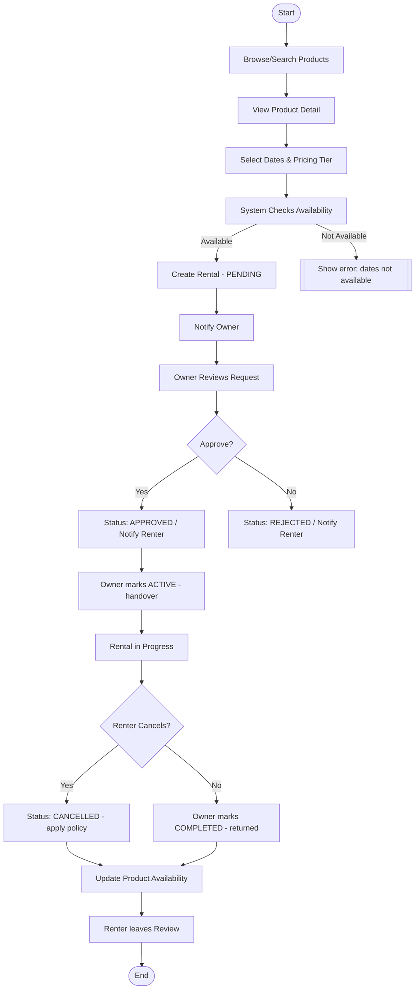

### 4.2 AI Recommendation Generation

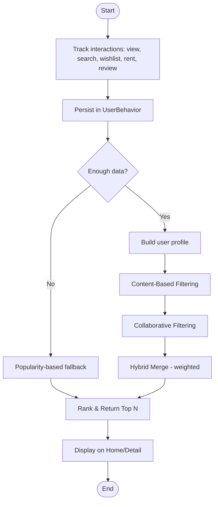

---

## 5) State Machine Diagrams

### 5.1 Rental Status States

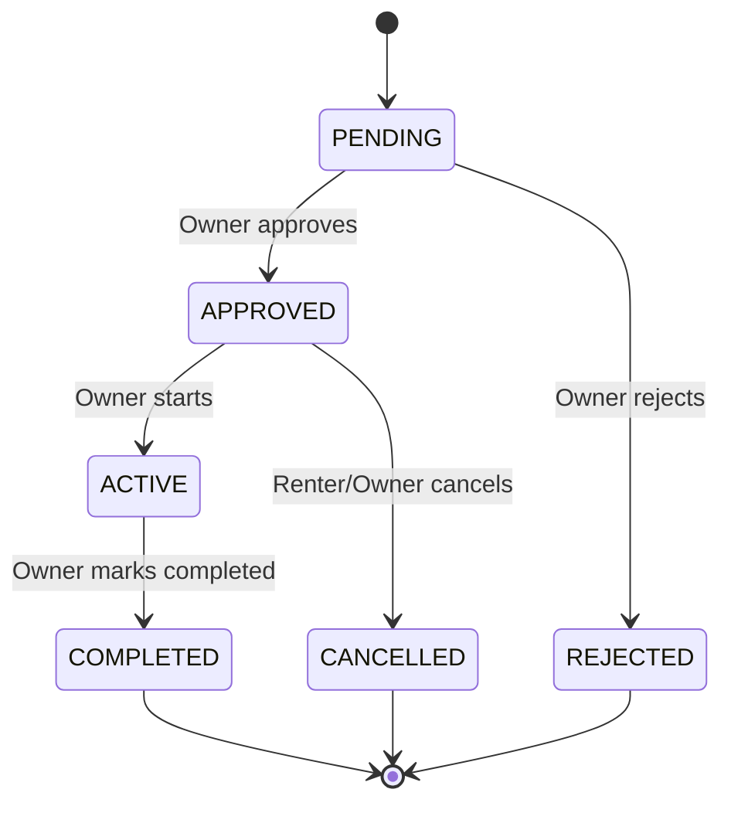

### 5.2 Product Status States

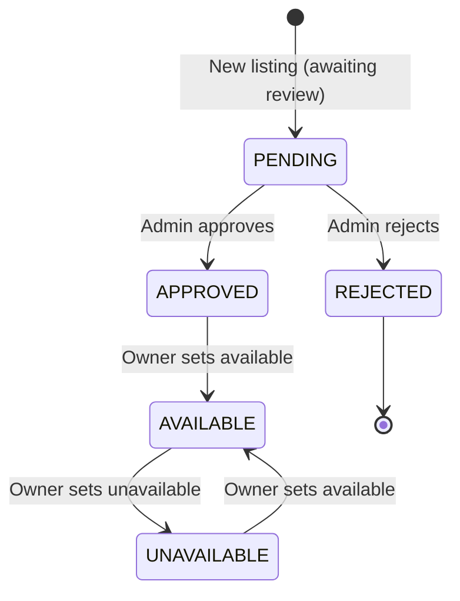

### 5.3 User Account Status States

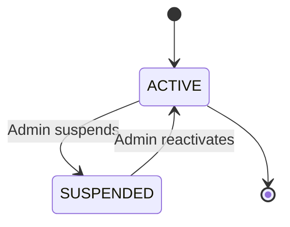

---

## 6) Component Diagram

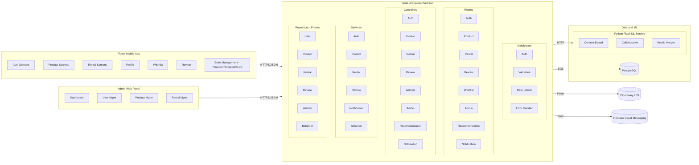

---

## 7) Deployment Diagram

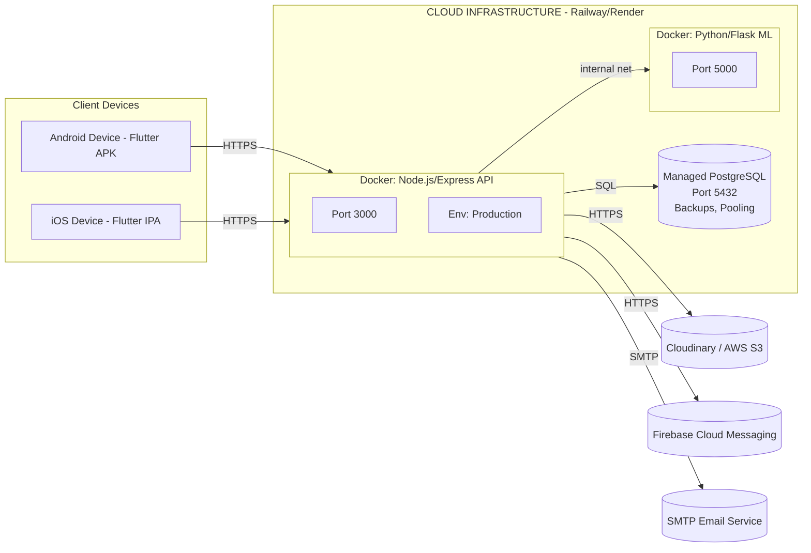

---

## 8) ERD (Entity‑Relationship Diagram)

```mermaid
erDiagram
  USERS ||--o{ PRODUCTS : owns
  USERS ||--o{ RENTALS : rents
  USERS ||--o{ REVIEWS : writes
  USERS ||--o{ WISHLISTS : saves
  USERS ||--o{ NOTIFICATIONS : receives
  USERS ||--o{ USER_BEHAVIORS : generates
  USERS ||--o{ RECOMMENDATIONS : gets

  CATEGORIES ||--o{ PRODUCTS : categorizes
  PRODUCTS ||--o{ PRODUCT_IMAGES : has
  PRODUCTS ||--o{ RENTALS : for
  PRODUCTS ||--o{ REVIEWS : receives
  PRODUCTS ||--o{ WISHLISTS : appears_in
  RENTALS ||--|| REVIEWS : has_one

  USERS {
    UUID id PK
    VARCHAR email
    TEXT password
    VARCHAR full_name
    VARCHAR phone
    TEXT avatar_url
    TEXT address
    ENUM role
    ENUM status
    TIMESTAMP created_at
    TIMESTAMP updated_at
  }
  CATEGORIES {
    UUID id PK
    VARCHAR name
    TEXT description
    VARCHAR icon
    BOOLEAN is_active
    TIMESTAMP created_at
    TIMESTAMP updated_at
  }
  PRODUCTS {
    UUID id PK
    UUID owner_id FK
    UUID category_id FK
    VARCHAR title
    TEXT description
    DECIMAL price_per_hour
    DECIMAL price_per_day
    DECIMAL price_per_week
    DECIMAL price_per_month
    ENUM condition
    VARCHAR city
    DECIMAL latitude
    DECIMAL longitude
    TEXT terms
    ENUM moderation_status
    ENUM availability_status
    DECIMAL average_rating
    INTEGER total_reviews
    TIMESTAMP created_at
    TIMESTAMP updated_at
  }
  PRODUCT_IMAGES {
    UUID id PK
    UUID product_id FK
    TEXT image_url
    BOOLEAN is_primary
    INT display_order
    TIMESTAMP created_at
  }
  WISHLISTS {
    UUID id PK
    UUID user_id FK
    UUID product_id FK
    TIMESTAMP created_at
  }
  REVIEWS {
    UUID id PK
    UUID product_id FK
    UUID renter_id FK
    UUID rental_id FK
    INT rating
    TEXT comment
    TEXT owner_reply
    TIMESTAMP created_at
  }
  RENTALS {
    UUID id PK
    UUID product_id FK
    UUID renter_id FK
    UUID owner_id FK
    TIMESTAMP start_at
    TIMESTAMP end_at
    ENUM pricing_tier
    DECIMAL total_price
    ENUM status
    TEXT cancellation_reason
    ENUM cancelled_by
    TIMESTAMP created_at
    TIMESTAMP updated_at
  }
  NOTIFICATIONS {
    UUID id PK
    UUID user_id FK
    VARCHAR title
    TEXT message
    ENUM type
    BOOLEAN is_read
    TIMESTAMP created_at
  }
  USER_BEHAVIORS {
    UUID id PK
    UUID user_id FK
    UUID product_id FK
    ENUM event_type
    VARCHAR search_query
    INT weight
    TIMESTAMP created_at
  }
  RECOMMENDATIONS {
    UUID id PK
    UUID user_id FK
    UUID product_id FK
    DECIMAL score
    ENUM algorithm
    TIMESTAMP created_at
  }
```

---

## 9) Package Diagram (Backend)

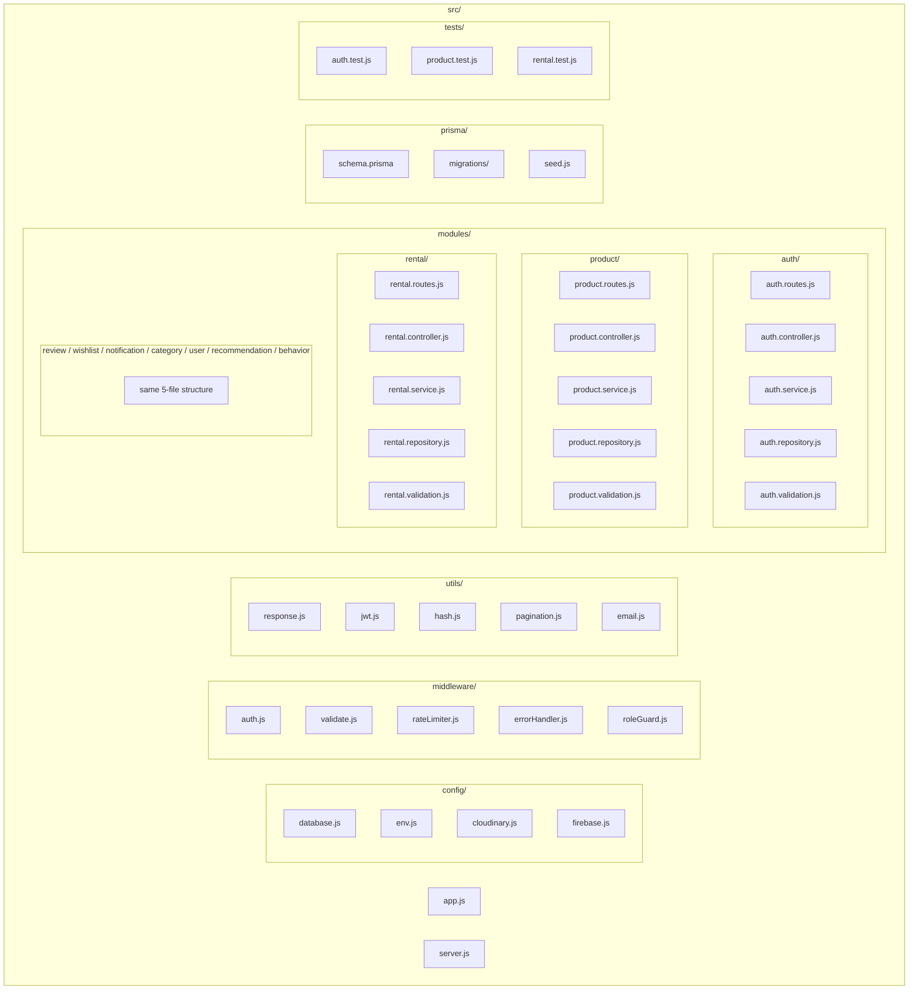

---

## 10) Data Flow Diagrams

### Level 0 — Context

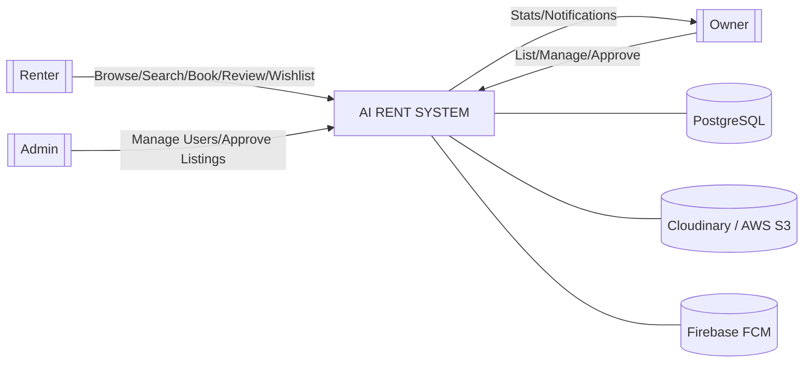

### Level 1 — Major Processes

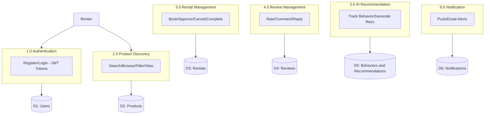

---

