# Backend Sequence Diagrams

These diagrams were traced from `src/app.js`, the route modules in `src/routes`, and the controller logic in `src/controllers`.

They focus on the main backend interactions for each endpoint:
- request validation
- authentication and admin middleware
- Prisma database access
- token and cookie work
- upload filesystem writes
- notification side effects

## Docs

### GET /api/v1/docs/openapi.json

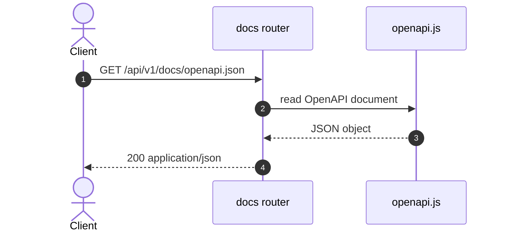
```mermaid
sequenceDiagram
  autonumber
  actor Client
  participant Docs as docs router
  participant Spec as openapi.js

  Client->>Docs: GET /api/v1/docs/openapi.json
  Docs->>Spec: read OpenAPI document
  Spec-->>Docs: JSON object
  Docs-->>Client: 200 application/json
```

### GET /api/v1/docs/

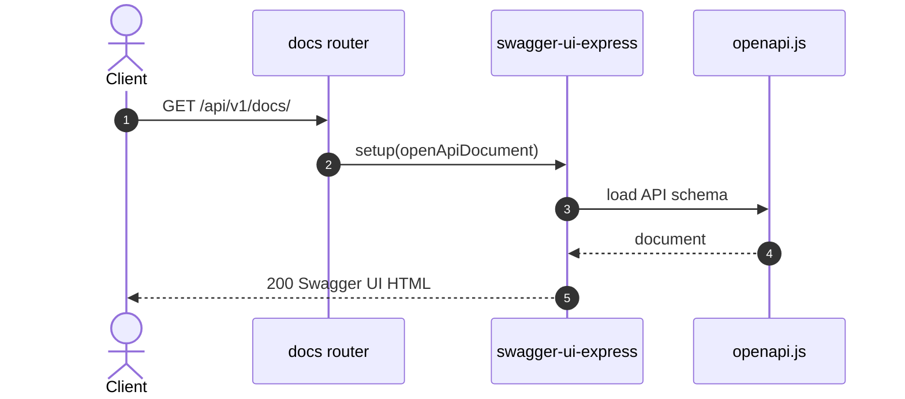
```mermaid
sequenceDiagram
  autonumber
  actor Client
  participant Docs as docs router
  participant Swagger as swagger-ui-express
  participant Spec as openapi.js

  Client->>Docs: GET /api/v1/docs/
  Docs->>Swagger: setup(openApiDocument)
  Swagger->>Spec: load API schema
  Spec-->>Swagger: document
  Swagger-->>Client: 200 Swagger UI HTML
```

## Auth

### POST /api/v1/auth/register

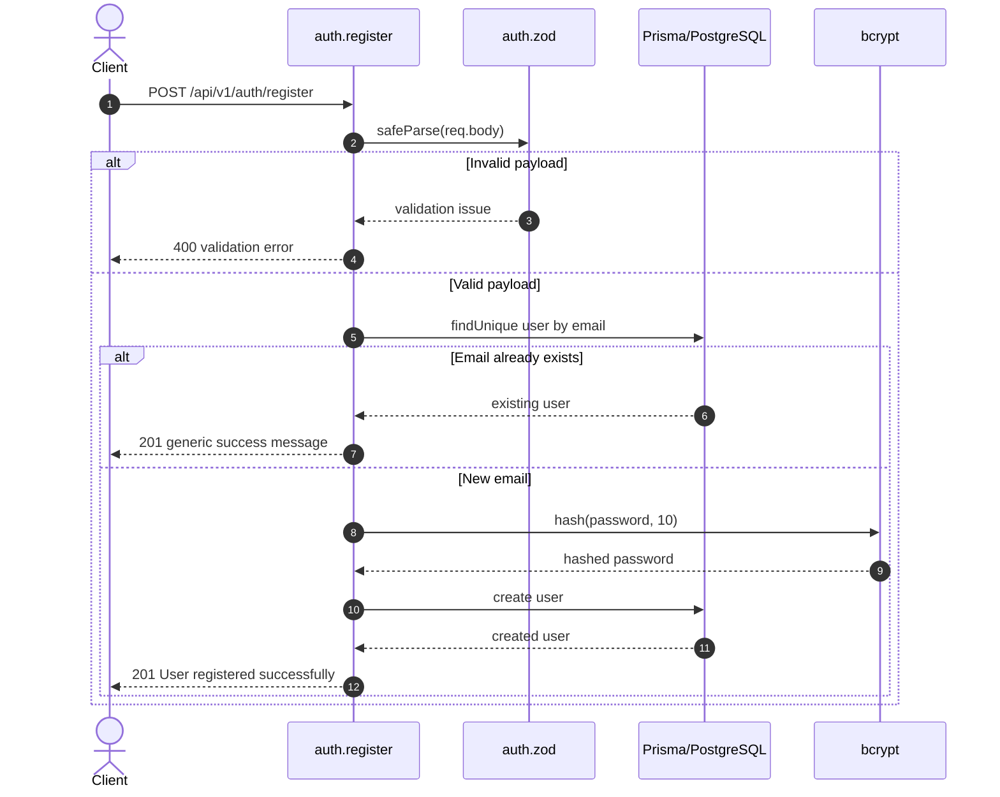
```mermaid
sequenceDiagram
  autonumber
  actor Client
  participant Controller as auth.register
  participant Validator as auth.zod
  participant DB as Prisma/PostgreSQL
  participant Crypto as bcrypt

  Client->>Controller: POST /api/v1/auth/register
  Controller->>Validator: safeParse(req.body)
  alt Invalid payload
    Validator-->>Controller: validation issue
    Controller-->>Client: 400 validation error
  else Valid payload
    Controller->>DB: findUnique user by email
    alt Email already exists
      DB-->>Controller: existing user
      Controller-->>Client: 201 generic success message
    else New email
      Controller->>Crypto: hash(password, 10)
      Crypto-->>Controller: hashed password
      Controller->>DB: create user
      DB-->>Controller: created user
      Controller-->>Client: 201 User registered successfully
    end
  end
```

### POST /api/v1/auth/login

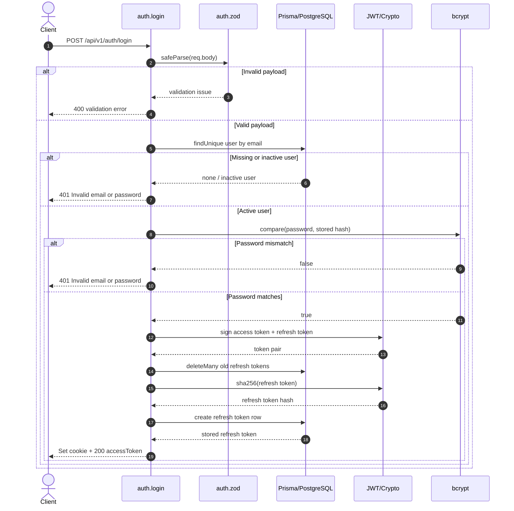
```mermaid
sequenceDiagram
  autonumber
  actor Client
  participant Controller as auth.login
  participant Validator as auth.zod
  participant DB as Prisma/PostgreSQL
  participant Token as JWT/Crypto
  participant Crypto as bcrypt

  Client->>Controller: POST /api/v1/auth/login
  Controller->>Validator: safeParse(req.body)
  alt Invalid payload
    Validator-->>Controller: validation issue
    Controller-->>Client: 400 validation error
  else Valid payload
    Controller->>DB: findUnique user by email
    alt Missing or inactive user
      DB-->>Controller: none / inactive user
      Controller-->>Client: 401 Invalid email or password
    else Active user
      Controller->>Crypto: compare(password, stored hash)
      alt Password mismatch
        Crypto-->>Controller: false
        Controller-->>Client: 401 Invalid email or password
      else Password matches
        Crypto-->>Controller: true
        Controller->>Token: sign access token + refresh token
        Token-->>Controller: token pair
        Controller->>DB: deleteMany old refresh tokens
        Controller->>Token: sha256(refresh token)
        Token-->>Controller: refresh token hash
        Controller->>DB: create refresh token row
        DB-->>Controller: stored refresh token
        Controller-->>Client: Set cookie + 200 accessToken
      end
    end
  end
```

### POST /api/v1/auth/refresh-token

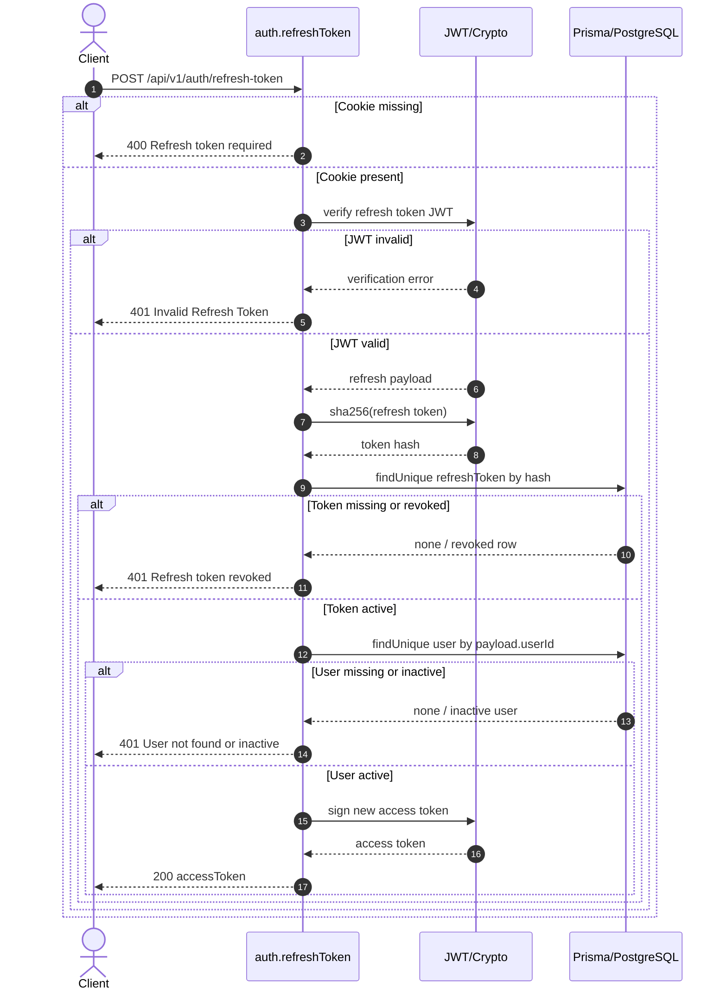
```mermaid
sequenceDiagram
  autonumber
  actor Client
  participant Controller as auth.refreshToken
  participant Token as JWT/Crypto
  participant DB as Prisma/PostgreSQL

  Client->>Controller: POST /api/v1/auth/refresh-token
  alt Cookie missing
    Controller-->>Client: 400 Refresh token required
  else Cookie present
    Controller->>Token: verify refresh token JWT
    alt JWT invalid
      Token-->>Controller: verification error
      Controller-->>Client: 401 Invalid Refresh Token
    else JWT valid
      Token-->>Controller: refresh payload
      Controller->>Token: sha256(refresh token)
      Token-->>Controller: token hash
      Controller->>DB: findUnique refreshToken by hash
      alt Token missing or revoked
        DB-->>Controller: none / revoked row
        Controller-->>Client: 401 Refresh token revoked
      else Token active
        Controller->>DB: findUnique user by payload.userId
        alt User missing or inactive
          DB-->>Controller: none / inactive user
          Controller-->>Client: 401 User not found or inactive
        else User active
          Controller->>Token: sign new access token
          Token-->>Controller: access token
          Controller-->>Client: 200 accessToken
        end
      end
    end
  end
```

### POST /api/v1/auth/logout

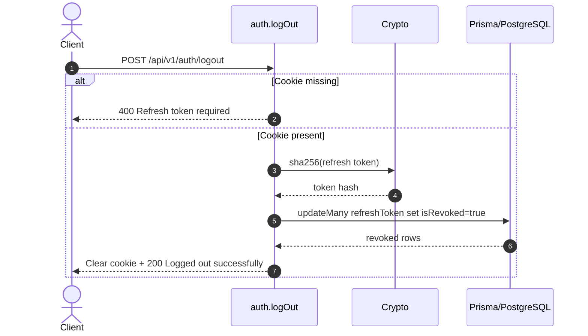
```mermaid
sequenceDiagram
  autonumber
  actor Client
  participant Controller as auth.logOut
  participant Token as Crypto
  participant DB as Prisma/PostgreSQL

  Client->>Controller: POST /api/v1/auth/logout
  alt Cookie missing
    Controller-->>Client: 400 Refresh token required
  else Cookie present
    Controller->>Token: sha256(refresh token)
    Token-->>Controller: token hash
    Controller->>DB: updateMany refreshToken set isRevoked=true
    DB-->>Controller: revoked rows
    Controller-->>Client: Clear cookie + 200 Logged out successfully
  end
```

### POST /api/v1/auth/forgot-password

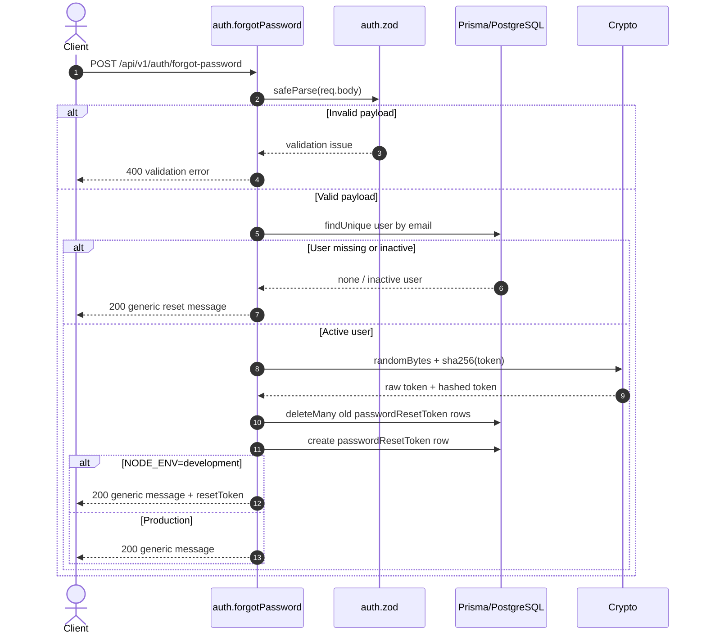
```mermaid
sequenceDiagram
  autonumber
  actor Client
  participant Controller as auth.forgotPassword
  participant Validator as auth.zod
  participant DB as Prisma/PostgreSQL
  participant Token as Crypto

  Client->>Controller: POST /api/v1/auth/forgot-password
  Controller->>Validator: safeParse(req.body)
  alt Invalid payload
    Validator-->>Controller: validation issue
    Controller-->>Client: 400 validation error
  else Valid payload
    Controller->>DB: findUnique user by email
    alt User missing or inactive
      DB-->>Controller: none / inactive user
      Controller-->>Client: 200 generic reset message
    else Active user
      Controller->>Token: randomBytes + sha256(token)
      Token-->>Controller: raw token + hashed token
      Controller->>DB: deleteMany old passwordResetToken rows
      Controller->>DB: create passwordResetToken row
      alt NODE_ENV=development
        Controller-->>Client: 200 generic message + resetToken
      else Production
        Controller-->>Client: 200 generic message
      end
    end
  end
```

### POST /api/v1/auth/reset-password

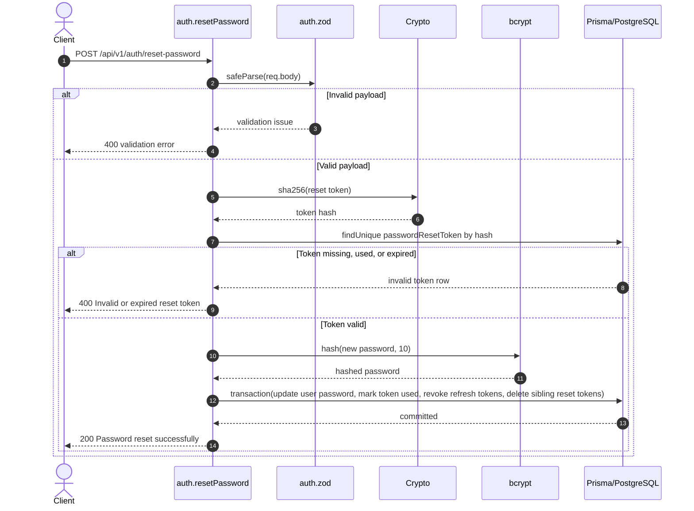
```mermaid
sequenceDiagram
  autonumber
  actor Client
  participant Controller as auth.resetPassword
  participant Validator as auth.zod
  participant Token as Crypto
  participant Crypto as bcrypt
  participant DB as Prisma/PostgreSQL

  Client->>Controller: POST /api/v1/auth/reset-password
  Controller->>Validator: safeParse(req.body)
  alt Invalid payload
    Validator-->>Controller: validation issue
    Controller-->>Client: 400 validation error
  else Valid payload
    Controller->>Token: sha256(reset token)
    Token-->>Controller: token hash
    Controller->>DB: findUnique passwordResetToken by hash
    alt Token missing, used, or expired
      DB-->>Controller: invalid token row
      Controller-->>Client: 400 Invalid or expired reset token
    else Token valid
      Controller->>Crypto: hash(new password, 10)
      Crypto-->>Controller: hashed password
      Controller->>DB: transaction(update user password, mark token used, revoke refresh tokens, delete sibling reset tokens)
      DB-->>Controller: committed
      Controller-->>Client: 200 Password reset successfully
    end
  end
```

## Authenticated Users

Protected endpoints in this section pass through `authMiddleWare.auth` before the controller.

### GET /api/v1/users/me

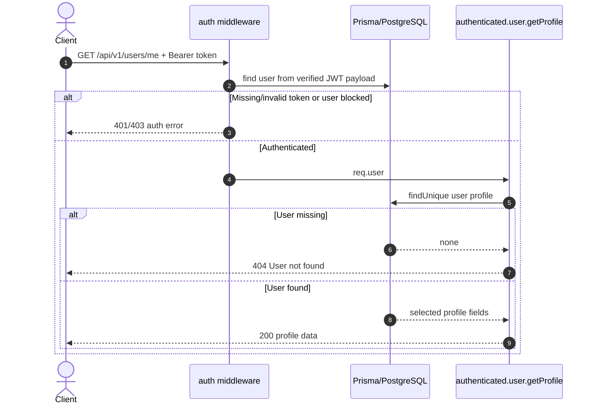
```mermaid
sequenceDiagram
  autonumber
  actor Client
  participant Auth as auth middleware
  participant DB as Prisma/PostgreSQL
  participant Controller as authenticated.user.getProfile

  Client->>Auth: GET /api/v1/users/me + Bearer token
  Auth->>DB: find user from verified JWT payload
  alt Missing/invalid token or user blocked
    Auth-->>Client: 401/403 auth error
  else Authenticated
    Auth->>Controller: req.user
    Controller->>DB: findUnique user profile
    alt User missing
      DB-->>Controller: none
      Controller-->>Client: 404 User not found
    else User found
      DB-->>Controller: selected profile fields
      Controller-->>Client: 200 profile data
    end
  end
```

### PUT /api/v1/users/me

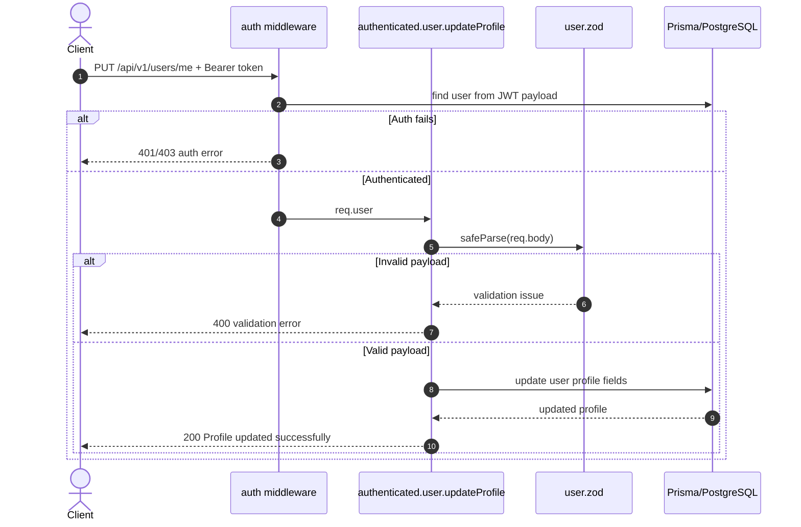
```mermaid
sequenceDiagram
  autonumber
  actor Client
  participant Auth as auth middleware
  participant Controller as authenticated.user.updateProfile
  participant Validator as user.zod
  participant DB as Prisma/PostgreSQL

  Client->>Auth: PUT /api/v1/users/me + Bearer token
  Auth->>DB: find user from JWT payload
  alt Auth fails
    Auth-->>Client: 401/403 auth error
  else Authenticated
    Auth->>Controller: req.user
    Controller->>Validator: safeParse(req.body)
    alt Invalid payload
      Validator-->>Controller: validation issue
      Controller-->>Client: 400 validation error
    else Valid payload
      Controller->>DB: update user profile fields
      DB-->>Controller: updated profile
      Controller-->>Client: 200 Profile updated successfully
    end
  end
```

### PUT /api/v1/users/change-password

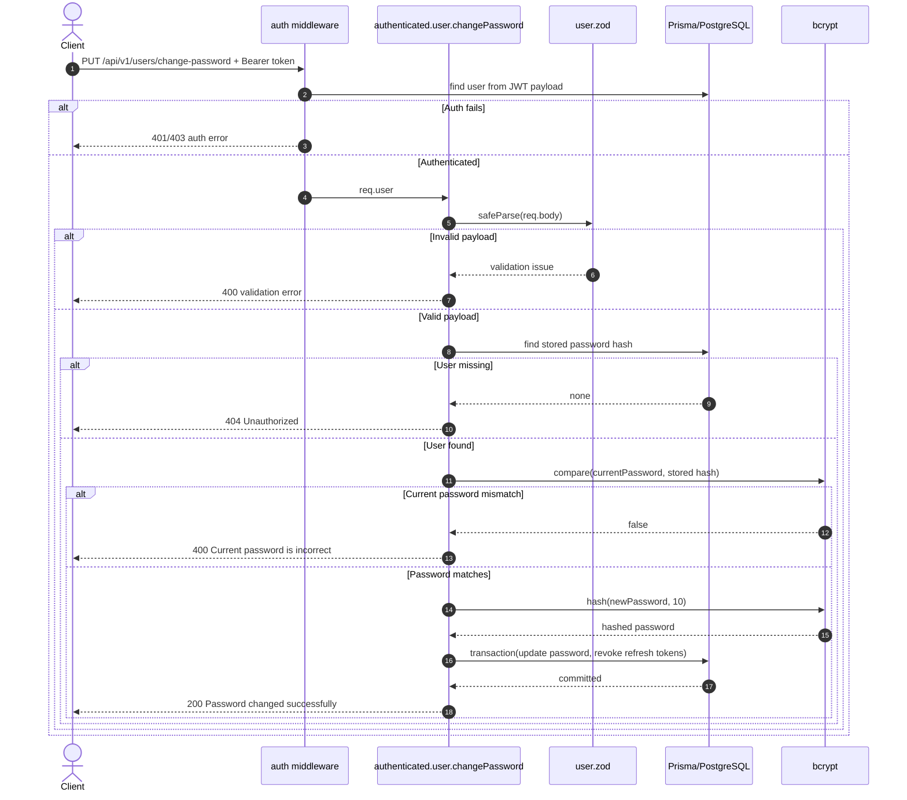
```mermaid
sequenceDiagram
  autonumber
  actor Client
  participant Auth as auth middleware
  participant Controller as authenticated.user.changePassword
  participant Validator as user.zod
  participant DB as Prisma/PostgreSQL
  participant Crypto as bcrypt

  Client->>Auth: PUT /api/v1/users/change-password + Bearer token
  Auth->>DB: find user from JWT payload
  alt Auth fails
    Auth-->>Client: 401/403 auth error
  else Authenticated
    Auth->>Controller: req.user
    Controller->>Validator: safeParse(req.body)
    alt Invalid payload
      Validator-->>Controller: validation issue
      Controller-->>Client: 400 validation error
    else Valid payload
      Controller->>DB: find stored password hash
      alt User missing
        DB-->>Controller: none
        Controller-->>Client: 404 Unauthorized
      else User found
        Controller->>Crypto: compare(currentPassword, stored hash)
        alt Current password mismatch
          Crypto-->>Controller: false
          Controller-->>Client: 400 Current password is incorrect
        else Password matches
          Controller->>Crypto: hash(newPassword, 10)
          Crypto-->>Controller: hashed password
          Controller->>DB: transaction(update password, revoke refresh tokens)
          DB-->>Controller: committed
          Controller-->>Client: 200 Password changed successfully
        end
      end
    end
  end
```

### POST /api/v1/users/upload-avatar

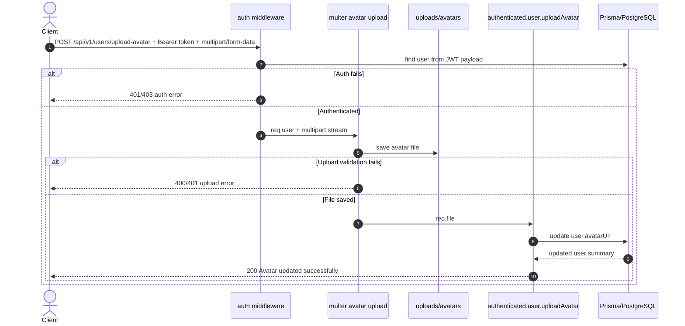
```mermaid
sequenceDiagram
  autonumber
  actor Client
  participant Auth as auth middleware
  participant Upload as multer avatar upload
  participant FS as uploads/avatars
  participant Controller as authenticated.user.uploadAvatar
  participant DB as Prisma/PostgreSQL

  Client->>Auth: POST /api/v1/users/upload-avatar + Bearer token + multipart/form-data
  Auth->>DB: find user from JWT payload
  alt Auth fails
    Auth-->>Client: 401/403 auth error
  else Authenticated
    Auth->>Upload: req.user + multipart stream
    Upload->>FS: save avatar file
    alt Upload validation fails
      Upload-->>Client: 400/401 upload error
    else File saved
      Upload->>Controller: req.file
      Controller->>DB: update user.avatarUrl
      DB-->>Controller: updated user summary
      Controller-->>Client: 200 Avatar updated successfully
    end
  end
```

## Public Users

### GET /api/v1/public/users/:id

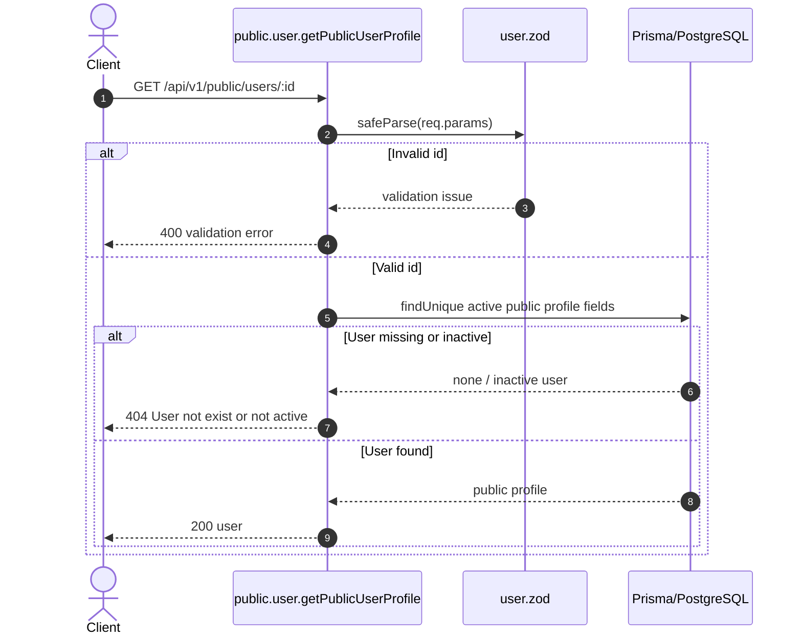
```mermaid
sequenceDiagram
  autonumber
  actor Client
  participant Controller as public.user.getPublicUserProfile
  participant Validator as user.zod
  participant DB as Prisma/PostgreSQL

  Client->>Controller: GET /api/v1/public/users/:id
  Controller->>Validator: safeParse(req.params)
  alt Invalid id
    Validator-->>Controller: validation issue
    Controller-->>Client: 400 validation error
  else Valid id
    Controller->>DB: findUnique active public profile fields
    alt User missing or inactive
      DB-->>Controller: none / inactive user
      Controller-->>Client: 404 User not exist or not active
    else User found
      DB-->>Controller: public profile
      Controller-->>Client: 200 user
    end
  end
```

### GET /api/v1/public/users/:id/products

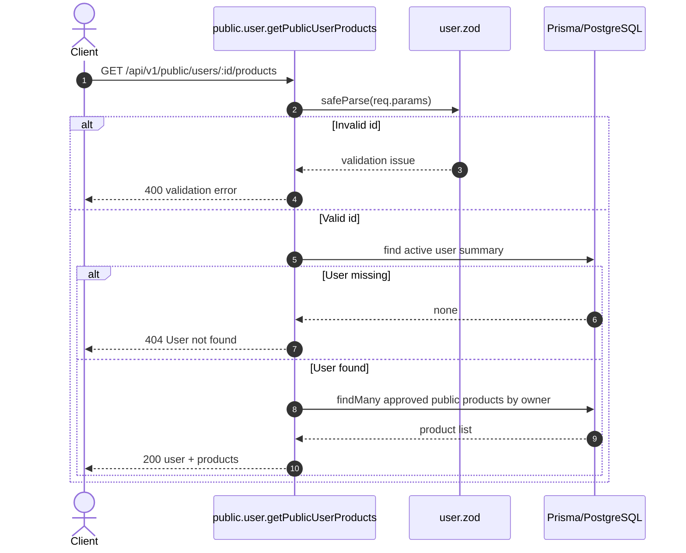
```mermaid
sequenceDiagram
  autonumber
  actor Client
  participant Controller as public.user.getPublicUserProducts
  participant Validator as user.zod
  participant DB as Prisma/PostgreSQL

  Client->>Controller: GET /api/v1/public/users/:id/products
  Controller->>Validator: safeParse(req.params)
  alt Invalid id
    Validator-->>Controller: validation issue
    Controller-->>Client: 400 validation error
  else Valid id
    Controller->>DB: find active user summary
    alt User missing
      DB-->>Controller: none
      Controller-->>Client: 404 User not found
    else User found
      Controller->>DB: findMany approved public products by owner
      DB-->>Controller: product list
      Controller-->>Client: 200 user + products
    end
  end
```

### GET /api/v1/public/users/:id/reviews

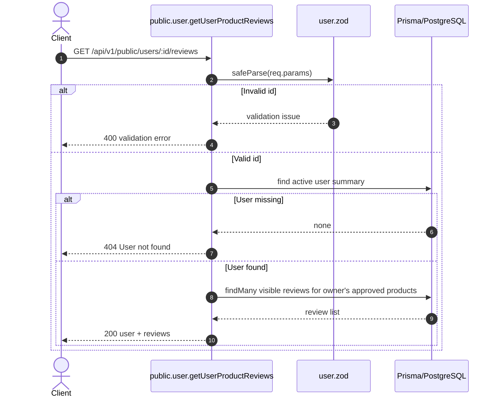
```mermaid
sequenceDiagram
  autonumber
  actor Client
  participant Controller as public.user.getUserProductReviews
  participant Validator as user.zod
  participant DB as Prisma/PostgreSQL

  Client->>Controller: GET /api/v1/public/users/:id/reviews
  Controller->>Validator: safeParse(req.params)
  alt Invalid id
    Validator-->>Controller: validation issue
    Controller-->>Client: 400 validation error
  else Valid id
    Controller->>DB: find active user summary
    alt User missing
      DB-->>Controller: none
      Controller-->>Client: 404 User not found
    else User found
      Controller->>DB: findMany visible reviews for owner's approved products
      DB-->>Controller: review list
      Controller-->>Client: 200 user + reviews
    end
  end
```

## Categories

Public reads are open. Write endpoints pass through both `authMiddleWare.auth` and `authMiddleWare.adminOnly`.

### GET /api/v1/categories

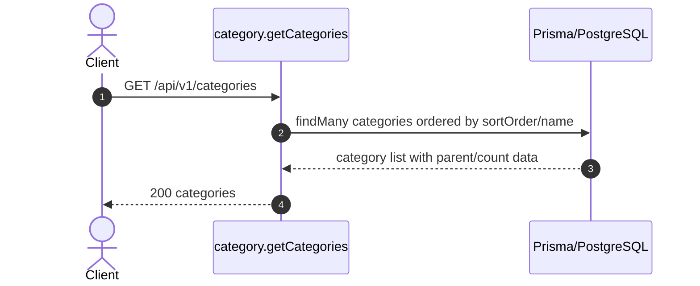
```mermaid
sequenceDiagram
  autonumber
  actor Client
  participant Controller as category.getCategories
  participant DB as Prisma/PostgreSQL

  Client->>Controller: GET /api/v1/categories
  Controller->>DB: findMany categories ordered by sortOrder/name
  DB-->>Controller: category list with parent/count data
  Controller-->>Client: 200 categories
```

### GET /api/v1/categories/:id

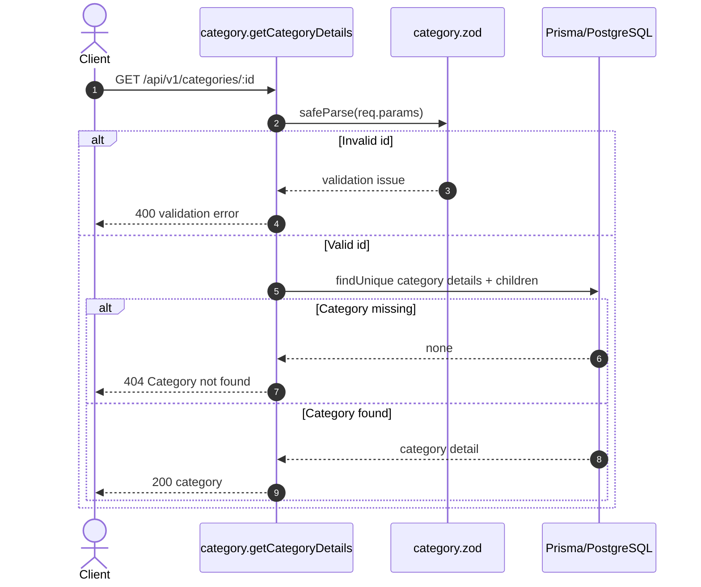
```mermaid
sequenceDiagram
  autonumber
  actor Client
  participant Controller as category.getCategoryDetails
  participant Validator as category.zod
  participant DB as Prisma/PostgreSQL

  Client->>Controller: GET /api/v1/categories/:id
  Controller->>Validator: safeParse(req.params)
  alt Invalid id
    Validator-->>Controller: validation issue
    Controller-->>Client: 400 validation error
  else Valid id
    Controller->>DB: findUnique category details + children
    alt Category missing
      DB-->>Controller: none
      Controller-->>Client: 404 Category not found
    else Category found
      DB-->>Controller: category detail
      Controller-->>Client: 200 category
    end
  end
```

### POST /api/v1/categories

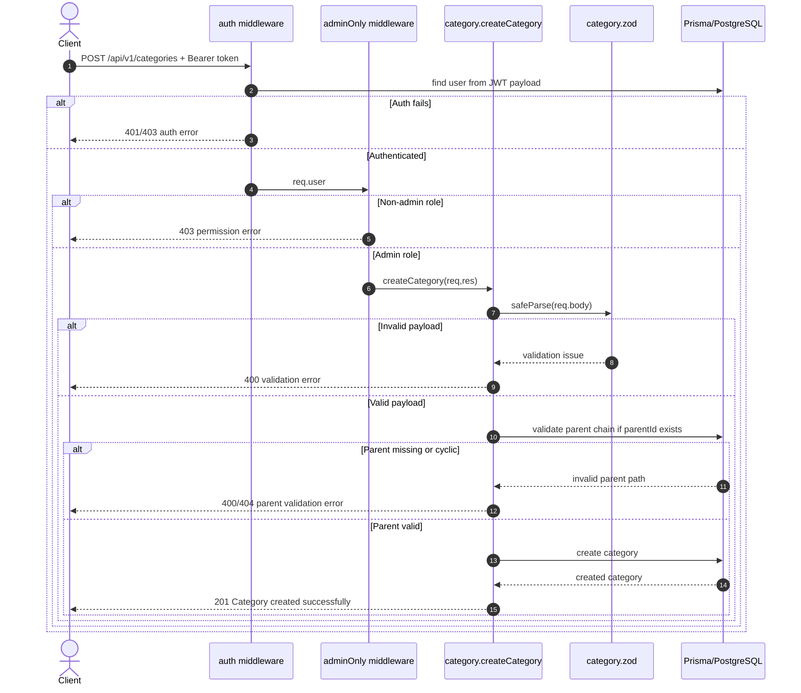
```mermaid
sequenceDiagram
  autonumber
  actor Client
  participant Auth as auth middleware
  participant Admin as adminOnly middleware
  participant Controller as category.createCategory
  participant Validator as category.zod
  participant DB as Prisma/PostgreSQL

  Client->>Auth: POST /api/v1/categories + Bearer token
  Auth->>DB: find user from JWT payload
  alt Auth fails
    Auth-->>Client: 401/403 auth error
  else Authenticated
    Auth->>Admin: req.user
    alt Non-admin role
      Admin-->>Client: 403 permission error
    else Admin role
      Admin->>Controller: createCategory(req,res)
      Controller->>Validator: safeParse(req.body)
      alt Invalid payload
        Validator-->>Controller: validation issue
        Controller-->>Client: 400 validation error
      else Valid payload
        Controller->>DB: validate parent chain if parentId exists
        alt Parent missing or cyclic
          DB-->>Controller: invalid parent path
          Controller-->>Client: 400/404 parent validation error
        else Parent valid
          Controller->>DB: create category
          DB-->>Controller: created category
          Controller-->>Client: 201 Category created successfully
        end
      end
    end
  end
```

### PUT /api/v1/categories/:id

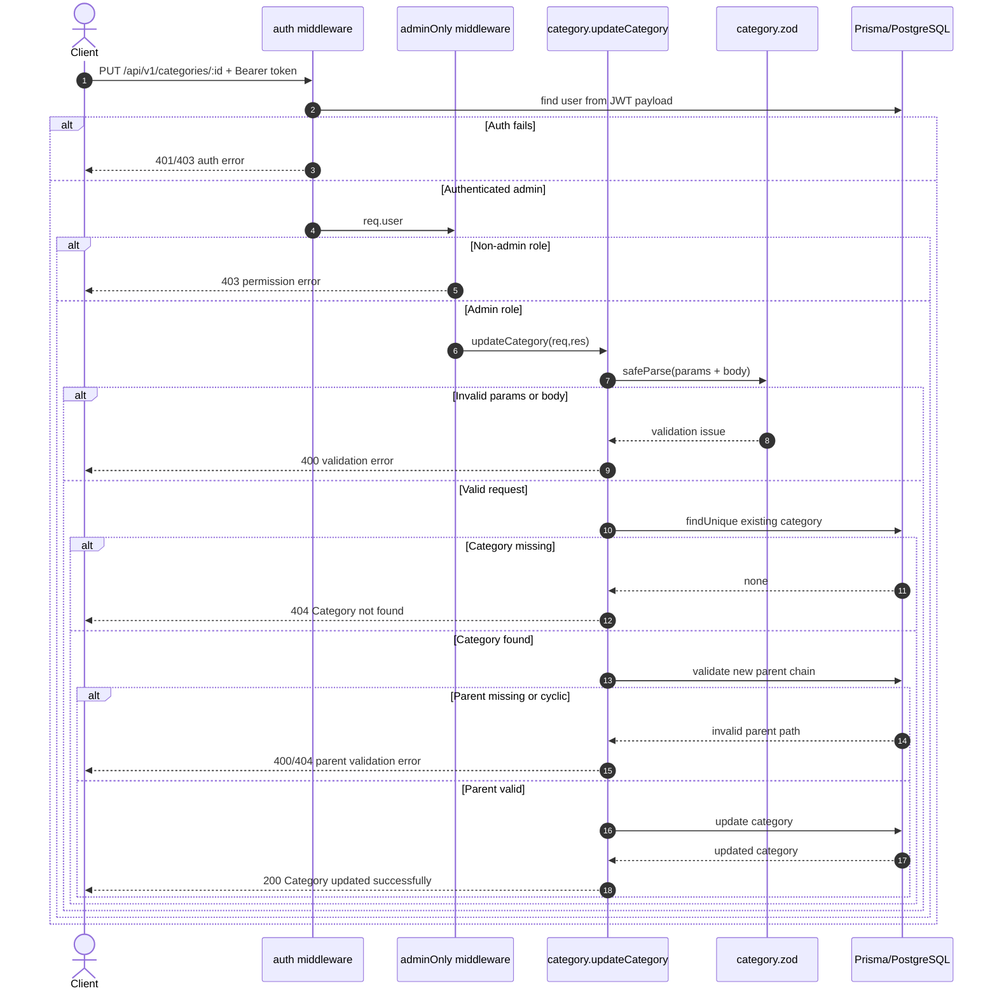
```mermaid
sequenceDiagram
  autonumber
  actor Client
  participant Auth as auth middleware
  participant Admin as adminOnly middleware
  participant Controller as category.updateCategory
  participant Validator as category.zod
  participant DB as Prisma/PostgreSQL

  Client->>Auth: PUT /api/v1/categories/:id + Bearer token
  Auth->>DB: find user from JWT payload
  alt Auth fails
    Auth-->>Client: 401/403 auth error
  else Authenticated admin
    Auth->>Admin: req.user
    alt Non-admin role
      Admin-->>Client: 403 permission error
    else Admin role
      Admin->>Controller: updateCategory(req,res)
      Controller->>Validator: safeParse(params + body)
      alt Invalid params or body
        Validator-->>Controller: validation issue
        Controller-->>Client: 400 validation error
      else Valid request
        Controller->>DB: findUnique existing category
        alt Category missing
          DB-->>Controller: none
          Controller-->>Client: 404 Category not found
        else Category found
          Controller->>DB: validate new parent chain
          alt Parent missing or cyclic
            DB-->>Controller: invalid parent path
            Controller-->>Client: 400/404 parent validation error
          else Parent valid
            Controller->>DB: update category
            DB-->>Controller: updated category
            Controller-->>Client: 200 Category updated successfully
          end
        end
      end
    end
  end
```

### DELETE /api/v1/categories/:id

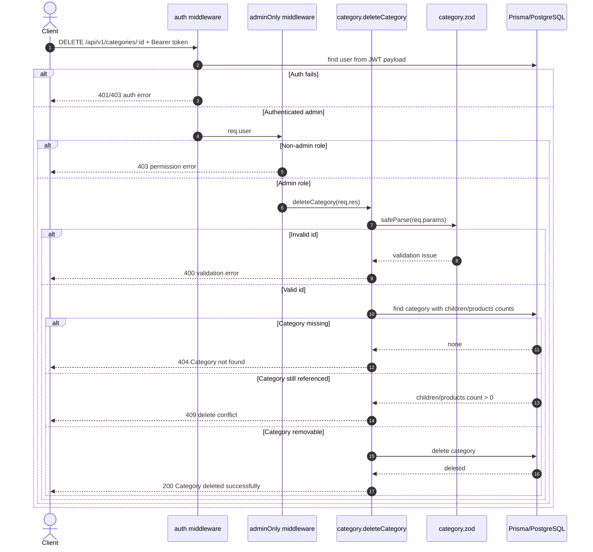
```mermaid
sequenceDiagram
  autonumber
  actor Client
  participant Auth as auth middleware
  participant Admin as adminOnly middleware
  participant Controller as category.deleteCategory
  participant Validator as category.zod
  participant DB as Prisma/PostgreSQL

  Client->>Auth: DELETE /api/v1/categories/:id + Bearer token
  Auth->>DB: find user from JWT payload
  alt Auth fails
    Auth-->>Client: 401/403 auth error
  else Authenticated admin
    Auth->>Admin: req.user
    alt Non-admin role
      Admin-->>Client: 403 permission error
    else Admin role
      Admin->>Controller: deleteCategory(req,res)
      Controller->>Validator: safeParse(req.params)
      alt Invalid id
        Validator-->>Controller: validation issue
        Controller-->>Client: 400 validation error
      else Valid id
        Controller->>DB: find category with children/products counts
        alt Category missing
          DB-->>Controller: none
          Controller-->>Client: 404 Category not found
        else Category still referenced
          DB-->>Controller: children/products count > 0
          Controller-->>Client: 409 delete conflict
        else Category removable
          Controller->>DB: delete category
          DB-->>Controller: deleted
          Controller-->>Client: 200 Category deleted successfully
        end
      end
    end
  end
```

## Products

### GET /api/v1/products

```mermaid
sequenceDiagram
  autonumber
  actor Client
  participant Controller as product.getProducts
  participant DB as Prisma/PostgreSQL

  Client->>Controller: GET /api/v1/products?page&limit&search&city&categoryId
  alt Invalid page or limit
    Controller-->>Client: 400 page and limit must be positive numbers
  else Valid query
    Controller->>DB: transaction(findMany public approved products, count total)
    DB-->>Controller: products + totalItems
    Controller-->>Client: 200 paginated product list
  end
```

### GET /api/v1/products/my-listings

```mermaid
sequenceDiagram
  autonumber
  actor Client
  participant Auth as auth middleware
  participant DB as Prisma/PostgreSQL
  participant Controller as product.getMyListings

  Client->>Auth: GET /api/v1/products/my-listings + Bearer token
  Auth->>DB: find user from JWT payload
  alt Auth fails
    Auth-->>Client: 401/403 auth error
  else Authenticated
    Auth->>Controller: req.user
    alt Invalid pagination or status filter
      Controller-->>Client: 400 query validation error
    else Valid query
      Controller->>DB: transaction(findMany owner products, count total)
      DB-->>Controller: listings + totalItems
      Controller-->>Client: 200 paginated listings
    end
  end
```

### POST /api/v1/products

```mermaid
sequenceDiagram
  autonumber
  actor Client
  participant Auth as auth middleware
  participant DB as Prisma/PostgreSQL
  participant Controller as product.createProduct
  participant Validator as product.zod
  participant Notify as createAdminNotifications

  Client->>Auth: POST /api/v1/products + Bearer token
  Auth->>DB: find user from JWT payload
  alt Auth fails
    Auth-->>Client: 401/403 auth error
  else Authenticated
    Auth->>Controller: req.user
    Controller->>Validator: safeParse(req.body)
    alt Invalid payload
      Validator-->>Controller: validation issue
      Controller-->>Client: 400 validation error
    else Valid payload
      Controller->>DB: find active category
      alt Category missing or inactive
        DB-->>Controller: none
        Controller-->>Client: 404 Category not found or inactive
      else Category found
        Controller->>DB: transaction(optional role upgrade, create product)
        DB-->>Controller: created product
        Controller->>Notify: create notifications for active admins
        Notify->>DB: createMany notification rows
        DB-->>Notify: stored notifications
        Controller-->>Client: 201 Listing created and sent for review
      end
    end
  end
```

### PUT /api/v1/products/:id

```mermaid
sequenceDiagram
  autonumber
  actor Client
  participant Auth as auth middleware
  participant Controller as product.updateProduct
  participant Validator as product.zod
  participant DB as Prisma/PostgreSQL

  Client->>Auth: PUT /api/v1/products/:id + Bearer token
  Auth->>DB: find user from JWT payload
  alt Auth fails
    Auth-->>Client: 401/403 auth error
  else Authenticated
    Auth->>Controller: req.user
    Controller->>Validator: safeParse(req.body)
    alt Missing id or invalid payload
      Validator-->>Controller: validation issue
      Controller-->>Client: 400 validation error
    else Valid request
      Controller->>DB: findUnique existing product
      alt Product missing
        DB-->>Controller: none
        Controller-->>Client: 404 Product not found
      else Non-owner non-admin
        DB-->>Controller: owner mismatch
        Controller-->>Client: 403 not allowed
      else Authorized editor
        opt categoryId changed
          Controller->>DB: find active category
          DB-->>Controller: category or none
        end
        alt category missing or pricing/rental-period rules fail
          Controller-->>Client: 400/404 update validation error
        else Update allowed
          Controller->>DB: update product fields
          DB-->>Controller: updated product
          Controller-->>Client: 200 Listing updated successfully
        end
      end
    end
  end
```

### PUT /api/v1/products/:id/status

```mermaid
sequenceDiagram
  autonumber
  actor Client
  participant Auth as auth middleware
  participant Controller as product.updateProductStatus
  participant Validator as product.zod
  participant DB as Prisma/PostgreSQL

  Client->>Auth: PUT /api/v1/products/:id/status + Bearer token
  Auth->>DB: find user from JWT payload
  alt Auth fails
    Auth-->>Client: 401/403 auth error
  else Authenticated
    Auth->>Controller: req.user
    Controller->>Validator: safeParse(params + body)
    alt Invalid id or status
      Validator-->>Controller: validation issue
      Controller-->>Client: 400 validation error
    else Valid request
      Controller->>DB: findUnique product owner
      alt Product missing
        DB-->>Controller: none
        Controller-->>Client: 404 Product not found
      else Not owner/admin
        DB-->>Controller: owner mismatch
        Controller-->>Client: 403 not allowed
      else Role cannot set requested status
        Controller-->>Client: 403 status not allowed
      else Authorized update
        Controller->>DB: update product status
        DB-->>Controller: updated product
        Controller-->>Client: 200 Listing status updated successfully
      end
    end
  end
```

### POST /api/v1/products/:id/images

```mermaid
sequenceDiagram
  autonumber
  actor Client
  participant Auth as auth middleware
  participant Upload as multer product image upload
  participant FS as uploads/products
  participant Controller as product.uploadProductImages
  participant Validator as product.zod
  participant DB as Prisma/PostgreSQL

  Client->>Auth: POST /api/v1/products/:id/images + Bearer token + multipart/form-data
  Auth->>DB: find user from JWT payload
  alt Auth fails
    Auth-->>Client: 401/403 auth error
  else Authenticated
    Auth->>Upload: req.user + multipart stream
    Upload->>FS: save uploaded image files
    alt Upload validation fails
      Upload-->>Client: 400/401 upload error
    else Files saved
      Upload->>Controller: req.files
      Controller->>Validator: safeParse(req.params)
      alt Invalid product id or no files
        Controller->>FS: cleanup saved files
        Controller-->>Client: 400 validation error
      else Valid request
        Controller->>DB: find product + existing images
        alt Product missing / unauthorized / max images exceeded
          Controller->>FS: cleanup saved files
          Controller-->>Client: 404/403/400 upload rejection
        else Upload allowed
          Controller->>DB: create productImage rows in transaction
          DB-->>Controller: created image records
          Controller-->>Client: 201 Listing images uploaded successfully
        end
      end
    end
  end
```

### DELETE /api/v1/products/:id/images/:imgId

```mermaid
sequenceDiagram
  autonumber
  actor Client
  participant Auth as auth middleware
  participant Controller as product.deleteProductImage
  participant Validator as product.zod
  participant DB as Prisma/PostgreSQL
  participant FS as uploads/products

  Client->>Auth: DELETE /api/v1/products/:id/images/:imgId + Bearer token
  Auth->>DB: find user from JWT payload
  alt Auth fails
    Auth-->>Client: 401/403 auth error
  else Authenticated
    Auth->>Controller: req.user
    Controller->>Validator: safeParse(req.params)
    alt Invalid ids
      Validator-->>Controller: validation issue
      Controller-->>Client: 400 validation error
    else Valid ids
      Controller->>DB: find product owner
      alt Product missing
        DB-->>Controller: none
        Controller-->>Client: 404 Product not found
      else Unauthorized
        DB-->>Controller: owner mismatch
        Controller-->>Client: 403 not allowed
      else Authorized
        Controller->>DB: find image by imgId + productId
        alt Image missing
          DB-->>Controller: none
          Controller-->>Client: 404 Product image not found
        else Image found
          Controller->>DB: transaction(delete image, promote replacement primary if needed)
          DB-->>Controller: committed
          Controller->>FS: delete stored image files
          FS-->>Controller: file cleanup result
          Controller-->>Client: 200 Listing image deleted successfully
        end
      end
    end
  end
```

### DELETE /api/v1/products/:id

```mermaid
sequenceDiagram
  autonumber
  actor Client
  participant Auth as auth middleware
  participant Controller as product.deleteProduct
  participant Validator as product.zod
  participant DB as Prisma/PostgreSQL
  participant FS as uploads/products

  Client->>Auth: DELETE /api/v1/products/:id + Bearer token
  Auth->>DB: find user from JWT payload
  alt Auth fails
    Auth-->>Client: 401/403 auth error
  else Authenticated
    Auth->>Controller: req.user
    Controller->>Validator: safeParse(req.params)
    alt Invalid id
      Validator-->>Controller: validation issue
      Controller-->>Client: 400 validation error
    else Valid id
      Controller->>DB: find product + image URLs
      alt Product missing
        DB-->>Controller: none
        Controller-->>Client: 404 Product not found
      else Unauthorized
        DB-->>Controller: owner mismatch
        Controller-->>Client: 403 not allowed
      else Authorized
        Controller->>DB: count rental records for product
        alt Rentals exist
          DB-->>Controller: count > 0
          Controller-->>Client: 409 listing cannot be deleted
        else No rentals
          Controller->>DB: delete product
          DB-->>Controller: deleted
          Controller->>FS: delete stored image files
          FS-->>Controller: file cleanup result
          Controller-->>Client: 200 Listing deleted successfully
        end
      end
    end
  end
```

### GET /api/v1/products/:id

```mermaid
sequenceDiagram
  autonumber
  actor Client
  participant Controller as product.getProductDetails
  participant DB as Prisma/PostgreSQL

  Client->>Controller: GET /api/v1/products/:id
  alt Missing product id
    Controller-->>Client: 400 Product id is required
  else Valid id
    Controller->>DB: findFirst approved public product with images, availability, reviews
    alt Product missing
      DB-->>Controller: none
      Controller-->>Client: 404 Product not found
    else Product found
      DB-->>Controller: product detail graph
      Controller-->>Client: 200 product details
    end
  end
```

## Rentals

`POST /`, `GET /my-bookings`, `GET /my-requests`, `PUT /:id/approve`, `PUT /:id/reject`, `PUT /:id/cancel`, `PUT /:id/start`, `PUT /:id/complete`, and `GET /:id` all pass through `authMiddleWare.auth`.

### POST /api/v1/rentals

```mermaid
sequenceDiagram
  autonumber
  actor Client
  participant Auth as auth middleware
  participant Controller as rental.createRental
  participant Validator as rental.zod
  participant DB as Prisma/PostgreSQL
  participant Notify as notification helpers

  Client->>Auth: POST /api/v1/rentals + Bearer token
  Auth->>DB: find user from JWT payload
  alt Auth fails
    Auth-->>Client: 401/403 auth error
  else Authenticated
    Auth->>Controller: req.user
    Controller->>Validator: safeParse(req.body)
    alt Invalid payload
      Validator-->>Controller: validation issue
      Controller-->>Client: 400 validation error
    else Valid payload
      Controller-->>Controller: reject startDate <= now
      Controller->>DB: find product pricing/owner/status fields
      alt Product missing, own listing, or not bookable
        DB-->>Controller: invalid product state
        Controller-->>Client: 404/409 rental creation rejected
      else Product bookable
        Controller-->>Controller: calculate pricing preview
        alt Pricing rules fail
          Controller-->>Client: 400 pricing/rental-period error
        else Pricing valid
          Controller->>DB: check overlapping rentals + availability calendar
          alt Date conflict exists
            DB-->>Controller: overlapping rental/calendar block
            Controller-->>Client: 409 selected dates unavailable
          else Date range available
            Controller->>DB: transaction(optional role upgrade, create rental, create behavior, notify owner)
            Controller->>Notify: create admin notifications
            Notify->>DB: createMany admin notification rows
            DB-->>Controller: committed transaction
            Controller->>DB: findUnique rental detail graph
            DB-->>Controller: rental detail
            Controller-->>Client: 201 Rental request created successfully
          end
        end
      end
    end
  end
```

### GET /api/v1/rentals/my-bookings

```mermaid
sequenceDiagram
  autonumber
  actor Client
  participant Auth as auth middleware
  participant Controller as rental.getMyBookings
  participant Validator as rental.zod
  participant DB as Prisma/PostgreSQL

  Client->>Auth: GET /api/v1/rentals/my-bookings + Bearer token
  Auth->>DB: find user from JWT payload
  alt Auth fails
    Auth-->>Client: 401/403 auth error
  else Authenticated
    Auth->>Controller: req.user
    Controller->>Validator: safeParse(req.query)
    alt Invalid query
      Validator-->>Controller: validation issue
      Controller-->>Client: 400 validation error
    else Valid query
      Controller->>DB: transaction(find renter rentals, count total)
      DB-->>Controller: rentals + totalItems
      Controller-->>Client: 200 paginated bookings
    end
  end
```

### GET /api/v1/rentals/my-requests

```mermaid
sequenceDiagram
  autonumber
  actor Client
  participant Auth as auth middleware
  participant Controller as rental.getMyRequests
  participant Validator as rental.zod
  participant DB as Prisma/PostgreSQL

  Client->>Auth: GET /api/v1/rentals/my-requests + Bearer token
  Auth->>DB: find user from JWT payload
  alt Auth fails
    Auth-->>Client: 401/403 auth error
  else Authenticated
    Auth->>Controller: req.user
    Controller->>Validator: safeParse(req.query)
    alt Invalid query
      Validator-->>Controller: validation issue
      Controller-->>Client: 400 validation error
    else Valid query
      Controller->>DB: transaction(find owner rentals, count total)
      DB-->>Controller: rentals + totalItems
      Controller-->>Client: 200 paginated rental requests
    end
  end
```

### GET /api/v1/rentals/:id/availability

```mermaid
sequenceDiagram
  autonumber
  actor Client
  participant Controller as rental.checkRentalAvailability
  participant Validator as rental.zod
  participant DB as Prisma/PostgreSQL

  Client->>Controller: GET /api/v1/rentals/:id/availability
  Controller->>Validator: safeParse(params + query)
  alt Invalid params or query
    Validator-->>Controller: validation issue
    Controller-->>Client: 400 validation error
  else Valid request
    Controller->>DB: find product pricing/status fields
    alt Product missing or not approved
      DB-->>Controller: none
      Controller-->>Client: 404 Listing not found
    else Product found
      alt startDate <= now
        Controller-->>Client: 400 Rental start date must be in the future
      else Future range
        opt Listing currently accepts requests
          Controller->>DB: check overlapping rentals + availability calendar
          DB-->>Controller: conflict data
        end
        opt rentalPeriodType provided
          Controller-->>Controller: calculate pricing preview
        end
        Controller-->>Client: 200 availability + pricing preview
      end
    end
  end
```

### PUT /api/v1/rentals/:id/approve

```mermaid
sequenceDiagram
  autonumber
  actor Client
  participant Auth as auth middleware
  participant Controller as rental.approveRental
  participant Validator as rental.zod
  participant DB as Prisma/PostgreSQL

  Client->>Auth: PUT /api/v1/rentals/:id/approve + Bearer token
  Auth->>DB: find user from JWT payload
  alt Auth fails
    Auth-->>Client: 401/403 auth error
  else Authenticated
    Auth->>Controller: req.user
    Controller->>Validator: safeParse(req.params)
    alt Invalid id
      Validator-->>Controller: validation issue
      Controller-->>Client: 400 validation error
    else Valid id
      Controller->>DB: find rental + product summary
      alt Rental missing
        DB-->>Controller: none
        Controller-->>Client: 404 Rental not found
      else Not owner/admin or invalid status/date/product state
        DB-->>Controller: rental state
        Controller-->>Client: 403/409 approval rejected
      else Approval possible
        Controller->>DB: re-check availability excluding current rental
        alt Conflict now exists
          DB-->>Controller: overlapping rental/calendar block
          Controller-->>Client: 409 dates unavailable
        else No conflict
          Controller->>DB: transaction(update rental status, notify renter)
          DB-->>Controller: committed
          Controller->>DB: findUnique rental detail graph
          DB-->>Controller: updated rental detail
          Controller-->>Client: 200 Rental approved successfully
        end
      end
    end
  end
```

### PUT /api/v1/rentals/:id/reject

```mermaid
sequenceDiagram
  autonumber
  actor Client
  participant Auth as auth middleware
  participant Controller as rental.rejectRental
  participant Validator as rental.zod
  participant DB as Prisma/PostgreSQL

  Client->>Auth: PUT /api/v1/rentals/:id/reject + Bearer token
  Auth->>DB: find user from JWT payload
  alt Auth fails
    Auth-->>Client: 401/403 auth error
  else Authenticated
    Auth->>Controller: req.user
    Controller->>Validator: safeParse(params + body)
    alt Invalid id or reason
      Validator-->>Controller: validation issue
      Controller-->>Client: 400 validation error
    else Valid request
      Controller->>DB: find rental + product title
      alt Rental missing
        DB-->>Controller: none
        Controller-->>Client: 404 Rental not found
      else Not owner/admin or rental not pending
        DB-->>Controller: invalid rental state
        Controller-->>Client: 403/409 reject not allowed
      else Reject allowed
        Controller->>DB: transaction(update rental status/ownerNotes, notify renter)
        DB-->>Controller: committed
        Controller->>DB: findUnique rental detail graph
        DB-->>Controller: updated rental detail
        Controller-->>Client: 200 Rental rejected successfully
      end
    end
  end
```

### PUT /api/v1/rentals/:id/cancel

```mermaid
sequenceDiagram
  autonumber
  actor Client
  participant Auth as auth middleware
  participant Controller as rental.cancelRental
  participant Validator as rental.zod
  participant DB as Prisma/PostgreSQL

  Client->>Auth: PUT /api/v1/rentals/:id/cancel + Bearer token
  Auth->>DB: find user from JWT payload
  alt Auth fails
    Auth-->>Client: 401/403 auth error
  else Authenticated
    Auth->>Controller: req.user
    Controller->>Validator: safeParse(params + body)
    alt Invalid id or reason
      Validator-->>Controller: validation issue
      Controller-->>Client: 400 validation error
    else Valid request
      Controller->>DB: find rental + product title
      alt Rental missing
        DB-->>Controller: none
        Controller-->>Client: 404 Rental not found
      else User cannot access rental or status not cancellable
        DB-->>Controller: invalid access/state
        Controller-->>Client: 403/409 cancel not allowed
      else Cancellation allowed
        Controller->>DB: transaction(update rental status, notify counterparty users)
        DB-->>Controller: committed
        Controller->>DB: findUnique rental detail graph
        DB-->>Controller: updated rental detail
        Controller-->>Client: 200 Rental cancelled successfully
      end
    end
  end
```

### PUT /api/v1/rentals/:id/start

```mermaid
sequenceDiagram
  autonumber
  actor Client
  participant Auth as auth middleware
  participant Controller as rental.startRental
  participant Validator as rental.zod
  participant DB as Prisma/PostgreSQL

  Client->>Auth: PUT /api/v1/rentals/:id/start + Bearer token
  Auth->>DB: find user from JWT payload
  alt Auth fails
    Auth-->>Client: 401/403 auth error
  else Authenticated
    Auth->>Controller: req.user
    Controller->>Validator: safeParse(req.params)
    alt Invalid id
      Validator-->>Controller: validation issue
      Controller-->>Client: 400 validation error
    else Valid id
      Controller->>DB: find rental + product title
      alt Rental missing
        DB-->>Controller: none
        Controller-->>Client: 404 Rental not found
      else Not owner/admin or rental not startable yet
        DB-->>Controller: invalid access/state/date
        Controller-->>Client: 403/409 start not allowed
      else Start allowed
        Controller->>DB: transaction(set rental active, set product rented, notify renter)
        DB-->>Controller: committed
        Controller->>DB: findUnique rental detail graph
        DB-->>Controller: updated rental detail
        Controller-->>Client: 200 Rental marked as active successfully
      end
    end
  end
```

### PUT /api/v1/rentals/:id/complete

```mermaid
sequenceDiagram
  autonumber
  actor Client
  participant Auth as auth middleware
  participant Controller as rental.completeRental
  participant Validator as rental.zod
  participant DB as Prisma/PostgreSQL

  Client->>Auth: PUT /api/v1/rentals/:id/complete + Bearer token
  Auth->>DB: find user from JWT payload
  alt Auth fails
    Auth-->>Client: 401/403 auth error
  else Authenticated
    Auth->>Controller: req.user
    Controller->>Validator: safeParse(req.params)
    alt Invalid id
      Validator-->>Controller: validation issue
      Controller-->>Client: 400 validation error
    else Valid id
      Controller->>DB: find rental + product status
      alt Rental missing
        DB-->>Controller: none
        Controller-->>Client: 404 Rental not found
      else Not owner/admin or rental not active
        DB-->>Controller: invalid access/state
        Controller-->>Client: 403/409 complete not allowed
      else Completion allowed
        Controller->>DB: transaction(mark rental completed, increment product rentals, maybe set product available, notify renter)
        DB-->>Controller: committed
        Controller->>DB: findUnique rental detail graph
        DB-->>Controller: updated rental detail
        Controller-->>Client: 200 Rental completed successfully
      end
    end
  end
```

### GET /api/v1/rentals/:id

```mermaid
sequenceDiagram
  autonumber
  actor Client
  participant Auth as auth middleware
  participant Controller as rental.getRentalDetails
  participant Validator as rental.zod
  participant DB as Prisma/PostgreSQL

  Client->>Auth: GET /api/v1/rentals/:id + Bearer token
  Auth->>DB: find user from JWT payload
  alt Auth fails
    Auth-->>Client: 401/403 auth error
  else Authenticated
    Auth->>Controller: req.user
    Controller->>Validator: safeParse(req.params)
    alt Invalid id
      Validator-->>Controller: validation issue
      Controller-->>Client: 400 validation error
    else Valid id
      Controller->>DB: findUnique rental detail graph
      alt Rental missing
        DB-->>Controller: none
        Controller-->>Client: 404 Rental not found
      else Caller cannot access rental
        Controller-->>Client: 403 not allowed
      else Access allowed
        DB-->>Controller: rental detail
        Controller-->>Client: 200 rental detail
      end
    end
  end
```

## Reviews

`POST /`, `PUT /:id`, `PUT /:id/reply`, and `DELETE /:id` pass through `authMiddleWare.auth`.

### POST /api/v1/reviews

```mermaid
sequenceDiagram
  autonumber
  actor Client
  participant Auth as auth middleware
  participant Controller as review.createReview
  participant Validator as review.zod
  participant DB as Prisma/PostgreSQL
  participant Notify as notification helpers

  Client->>Auth: POST /api/v1/reviews + Bearer token
  Auth->>DB: find user from JWT payload
  alt Auth fails
    Auth-->>Client: 401/403 auth error
  else Authenticated
    Auth->>Controller: req.user
    Controller->>Validator: safeParse(req.body)
    alt Invalid payload
      Validator-->>Controller: validation issue
      Controller-->>Client: 400 validation error
    else Valid payload
      Controller->>DB: find rental + product + existing review
      alt Rental missing / wrong renter / not completed / review exists
        DB-->>Controller: invalid rental state
        Controller-->>Client: 404/403/409 review creation rejected
      else Review allowed
        Controller->>DB: transaction(create review, create behavior, notify owner, sync product stats)
        Controller->>Notify: create admin notifications
        Notify->>DB: createMany admin notification rows
        DB-->>Controller: committed
        Controller->>DB: findUnique review detail graph
        DB-->>Controller: review detail
        Controller-->>Client: 201 Review created successfully
      end
    end
  end
```

### GET /api/v1/reviews/product/:id

```mermaid
sequenceDiagram
  autonumber
  actor Client
  participant Controller as review.getProductReviews
  participant Validator as review.zod
  participant DB as Prisma/PostgreSQL

  Client->>Controller: GET /api/v1/reviews/product/:id
  Controller->>Validator: safeParse(params + query)
  alt Invalid params or query
    Validator-->>Controller: validation issue
    Controller-->>Client: 400 validation error
  else Valid request
    Controller->>DB: find public approved product summary
    alt Product missing
      DB-->>Controller: none
      Controller-->>Client: 404 Product not found
    else Product found
      Controller->>DB: transaction(find visible reviews, count total)
      DB-->>Controller: reviews + totalItems
      Controller-->>Client: 200 product reviews
    end
  end
```

### PUT /api/v1/reviews/:id

```mermaid
sequenceDiagram
  autonumber
  actor Client
  participant Auth as auth middleware
  participant Controller as review.updateOwnReview
  participant Validator as review.zod
  participant DB as Prisma/PostgreSQL

  Client->>Auth: PUT /api/v1/reviews/:id + Bearer token
  Auth->>DB: find user from JWT payload
  alt Auth fails
    Auth-->>Client: 401/403 auth error
  else Authenticated
    Auth->>Controller: req.user
    Controller->>Validator: safeParse(params + body)
    alt Invalid id or payload
      Validator-->>Controller: validation issue
      Controller-->>Client: 400 validation error
    else Valid request
      Controller->>DB: find review owner/product
      alt Review missing
        DB-->>Controller: none
        Controller-->>Client: 404 Review not found
      else Not review owner
        Controller-->>Client: 403 not allowed
      else Update allowed
        Controller->>DB: transaction(update review, recompute product review stats)
        DB-->>Controller: committed
        Controller->>DB: findUnique review detail graph
        DB-->>Controller: updated review detail
        Controller-->>Client: 200 Review updated successfully
      end
    end
  end
```

### PUT /api/v1/reviews/:id/reply

```mermaid
sequenceDiagram
  autonumber
  actor Client
  participant Auth as auth middleware
  participant Controller as review.replyToReview
  participant Validator as review.zod
  participant DB as Prisma/PostgreSQL

  Client->>Auth: PUT /api/v1/reviews/:id/reply + Bearer token
  Auth->>DB: find user from JWT payload
  alt Auth fails
    Auth-->>Client: 401/403 auth error
  else Authenticated
    Auth->>Controller: req.user
    Controller->>Validator: safeParse(params + body)
    alt Invalid id or reply
      Validator-->>Controller: validation issue
      Controller-->>Client: 400 validation error
    else Valid request
      Controller->>DB: find review + product owner
      alt Review missing
        DB-->>Controller: none
        Controller-->>Client: 404 Review not found
      else Caller is not product owner
        Controller-->>Client: 403 not allowed
      else Reply allowed
        Controller->>DB: transaction(update owner reply, notify reviewer)
        DB-->>Controller: committed
        Controller->>DB: findUnique review detail graph
        DB-->>Controller: updated review detail
        Controller-->>Client: 200 Reply added successfully
      end
    end
  end
```

### DELETE /api/v1/reviews/:id

```mermaid
sequenceDiagram
  autonumber
  actor Client
  participant Auth as auth middleware
  participant Controller as review.deleteOwnReview
  participant Validator as review.zod
  participant DB as Prisma/PostgreSQL

  Client->>Auth: DELETE /api/v1/reviews/:id + Bearer token
  Auth->>DB: find user from JWT payload
  alt Auth fails
    Auth-->>Client: 401/403 auth error
  else Authenticated
    Auth->>Controller: req.user
    Controller->>Validator: safeParse(req.params)
    alt Invalid id
      Validator-->>Controller: validation issue
      Controller-->>Client: 400 validation error
    else Valid id
      Controller->>DB: find review owner/product
      alt Review missing
        DB-->>Controller: none
        Controller-->>Client: 404 Review not found
      else Not review owner
        Controller-->>Client: 403 not allowed
      else Delete allowed
        Controller->>DB: transaction(delete review, recompute product review stats)
        DB-->>Controller: committed
        Controller-->>Client: 200 Review deleted successfully
      end
    end
  end
```

## Wishlists

All wishlist endpoints pass through `authMiddleWare.auth`.

### GET /api/v1/wishlists

```mermaid
sequenceDiagram
  autonumber
  actor Client
  participant Auth as auth middleware
  participant Controller as wishlist.getMyWishlist
  participant Validator as wishlist.zod
  participant DB as Prisma/PostgreSQL

  Client->>Auth: GET /api/v1/wishlists + Bearer token
  Auth->>DB: find user from JWT payload
  alt Auth fails
    Auth-->>Client: 401/403 auth error
  else Authenticated
    Auth->>Controller: req.user
    Controller->>Validator: safeParse(req.query)
    alt Invalid query
      Validator-->>Controller: validation issue
      Controller-->>Client: 400 validation error
    else Valid query
      Controller->>DB: transaction(find wishlist items, count total)
      DB-->>Controller: wishlists + totalItems
      Controller-->>Client: 200 paginated wishlist
    end
  end
```

### POST /api/v1/wishlists/:productId

```mermaid
sequenceDiagram
  autonumber
  actor Client
  participant Auth as auth middleware
  participant Controller as wishlist.addToWishlist
  participant Validator as wishlist.zod
  participant DB as Prisma/PostgreSQL

  Client->>Auth: POST /api/v1/wishlists/:productId + Bearer token
  Auth->>DB: find user from JWT payload
  alt Auth fails
    Auth-->>Client: 401/403 auth error
  else Authenticated
    Auth->>Controller: req.user
    Controller->>Validator: safeParse(req.params)
    alt Invalid product id
      Validator-->>Controller: validation issue
      Controller-->>Client: 400 validation error
    else Valid id
      Controller->>DB: find approved public product
      alt Product missing
        DB-->>Controller: none
        Controller-->>Client: 404 Product not found
      else Product found
        Controller->>DB: find existing wishlist row
        alt Already wishlisted
          DB-->>Controller: existing wishlist
          Controller-->>Client: 200 Product is already in your wishlist
        else New wishlist item
          Controller->>DB: transaction(create wishlist, create behavior)
          DB-->>Controller: committed
          Controller->>DB: findUnique created wishlist with product graph
          DB-->>Controller: wishlist detail
          Controller-->>Client: 201 Product added to wishlist successfully
        end
      end
    end
  end
```

### DELETE /api/v1/wishlists/:productId

```mermaid
sequenceDiagram
  autonumber
  actor Client
  participant Auth as auth middleware
  participant Controller as wishlist.removeFromWishlist
  participant Validator as wishlist.zod
  participant DB as Prisma/PostgreSQL

  Client->>Auth: DELETE /api/v1/wishlists/:productId + Bearer token
  Auth->>DB: find user from JWT payload
  alt Auth fails
    Auth-->>Client: 401/403 auth error
  else Authenticated
    Auth->>Controller: req.user
    Controller->>Validator: safeParse(req.params)
    alt Invalid product id
      Validator-->>Controller: validation issue
      Controller-->>Client: 400 validation error
    else Valid id
      Controller->>DB: find wishlist row by userId + productId
      alt Wishlist row missing
        DB-->>Controller: none
        Controller-->>Client: 404 Product is not in your wishlist
      else Wishlist row found
        Controller->>DB: delete wishlist row
        DB-->>Controller: deleted
        Controller-->>Client: 200 Product removed from wishlist successfully
      end
    end
  end
```

## Recommendations

### GET /api/v1/recommendations

```mermaid
sequenceDiagram
  autonumber
  actor Client
  participant Auth as auth middleware
  participant Controller as recommendation.getRecommendations
  participant Validator as recommendation.zod
  participant DB as Prisma/PostgreSQL

  Client->>Auth: GET /api/v1/recommendations + Bearer token
  Auth->>DB: find user from JWT payload
  alt Auth fails
    Auth-->>Client: 401/403 auth error
  else Authenticated
    Auth->>Controller: req.user
    Controller->>Validator: safeParse(req.query)
    alt Invalid query
      Validator-->>Controller: validation issue
      Controller-->>Client: 400 validation error
    else Valid query
      Controller->>DB: transaction(load user behaviors, wishlists, rentals, reviews)
      DB-->>Controller: preference signals
      Controller-->>Controller: build preference profile + candidate filters
      Controller->>DB: fetch public product candidates
      DB-->>Controller: candidate products
      Controller-->>Controller: score products or fall back to popularity
      Controller-->>Client: 200 personalized recommendations
    end
  end
```

### GET /api/v1/recommendations/similar/:productId

```mermaid
sequenceDiagram
  autonumber
  actor Client
  participant Controller as recommendation.getSimilarProducts
  participant Validator as recommendation.zod
  participant DB as Prisma/PostgreSQL

  Client->>Controller: GET /api/v1/recommendations/similar/:productId
  Controller->>Validator: safeParse(params + query)
  alt Invalid params or query
    Validator-->>Controller: validation issue
    Controller-->>Client: 400 validation error
  else Valid request
    Controller->>DB: find public base product
    alt Product missing
      DB-->>Controller: none
      Controller-->>Client: 404 Product not found
    else Product found
      Controller-->>Controller: build category/city/tag candidate filters
      Controller->>DB: fetch similar candidates or public fallback set
      DB-->>Controller: candidate products
      Controller-->>Controller: score candidates against base product
      Controller-->>Client: 200 similar products
    end
  end
```

## Behavior

All behavior tracking passes through `authMiddleWare.auth`.

### POST /api/v1/behavior/track

```mermaid
sequenceDiagram
  autonumber
  actor Client
  participant Auth as auth middleware
  participant Controller as behavior.trackBehavior
  participant Validator as behavior.zod
  participant DB as Prisma/PostgreSQL

  Client->>Auth: POST /api/v1/behavior/track + Bearer token
  Auth->>DB: find user from JWT payload
  alt Auth fails
    Auth-->>Client: 401/403 auth error
  else Authenticated
    Auth->>Controller: req.user
    Controller->>Validator: safeParse(req.body)
    alt Invalid payload
      Validator-->>Controller: validation issue
      Controller-->>Client: 400 validation error
    else Valid payload
      opt productId provided
        Controller->>DB: find product + categoryId
        alt Product missing
          DB-->>Controller: none
          Controller-->>Client: 404 Product not found
        end
      end
      opt categoryId provided
        Controller->>DB: find category
        alt Category missing
          DB-->>Controller: none
          Controller-->>Client: 404 Category not found
        end
      end
      alt categoryId does not match product.categoryId
        Controller-->>Client: 400 category mismatch
      else Consistent behavior payload
        Controller->>DB: transaction(optional increment product viewCount, create userBehavior row)
        DB-->>Controller: created behavior
        Controller-->>Client: 201 Behavior tracked successfully
      end
    end
  end
```

## Notifications

All notification endpoints pass through `authMiddleWare.auth`.

### GET /api/v1/notifications

```mermaid
sequenceDiagram
  autonumber
  actor Client
  participant Auth as auth middleware
  participant Controller as notification.getNotifications
  participant Validator as notification.zod
  participant DB as Prisma/PostgreSQL

  Client->>Auth: GET /api/v1/notifications + Bearer token
  Auth->>DB: find user from JWT payload
  alt Auth fails
    Auth-->>Client: 401/403 auth error
  else Authenticated
    Auth->>Controller: req.user
    Controller->>Validator: safeParse(req.query)
    alt Invalid query
      Validator-->>Controller: validation issue
      Controller-->>Client: 400 validation error
    else Valid query
      Controller->>DB: transaction(find notifications, count filtered total, count unread)
      DB-->>Controller: notifications + counts
      Controller-->>Client: 200 paginated notifications
    end
  end
```

### PUT /api/v1/notifications/read-all

```mermaid
sequenceDiagram
  autonumber
  actor Client
  participant Auth as auth middleware
  participant Controller as notification.markAllNotificationsAsRead
  participant DB as Prisma/PostgreSQL

  Client->>Auth: PUT /api/v1/notifications/read-all + Bearer token
  Auth->>DB: find user from JWT payload
  alt Auth fails
    Auth-->>Client: 401/403 auth error
  else Authenticated
    Auth->>Controller: req.user
    Controller->>DB: updateMany unread notifications for user
    DB-->>Controller: affected row count
    Controller-->>Client: 200 All notifications marked as read
  end
```

### GET /api/v1/notifications/unread-count

```mermaid
sequenceDiagram
  autonumber
  actor Client
  participant Auth as auth middleware
  participant Controller as notification.getUnreadNotificationsCount
  participant DB as Prisma/PostgreSQL

  Client->>Auth: GET /api/v1/notifications/unread-count + Bearer token
  Auth->>DB: find user from JWT payload
  alt Auth fails
    Auth-->>Client: 401/403 auth error
  else Authenticated
    Auth->>Controller: req.user
    Controller->>DB: count unread notifications for user
    DB-->>Controller: unreadCount
    Controller-->>Client: 200 unreadCount
  end
```

### PUT /api/v1/notifications/:id/read

```mermaid
sequenceDiagram
  autonumber
  actor Client
  participant Auth as auth middleware
  participant Controller as notification.markNotificationAsRead
  participant Validator as notification.zod
  participant DB as Prisma/PostgreSQL

  Client->>Auth: PUT /api/v1/notifications/:id/read + Bearer token
  Auth->>DB: find user from JWT payload
  alt Auth fails
    Auth-->>Client: 401/403 auth error
  else Authenticated
    Auth->>Controller: req.user
    Controller->>Validator: safeParse(req.params)
    alt Invalid id
      Validator-->>Controller: validation issue
      Controller-->>Client: 400 validation error
    else Valid id
      Controller->>DB: find notification owned by user
      alt Notification missing
        DB-->>Controller: none
        Controller-->>Client: 404 Notification not found
      else Already read
        DB-->>Controller: existing read notification
        Controller-->>Client: 200 already marked as read
      else Unread notification
        Controller->>DB: update notification isRead/readAt
        DB-->>Controller: updated notification
        Controller-->>Client: 200 Notification marked as read successfully
      end
    end
  end
```

## Admin

All admin endpoints pass through both `authMiddleWare.auth` and `authMiddleWare.adminOnly` before the controller.

### GET /api/v1/admin/dashboard

```mermaid
sequenceDiagram
  autonumber
  actor Client
  participant Auth as auth middleware
  participant Admin as adminOnly middleware
  participant Controller as admin.getDashboard
  participant DB as Prisma/PostgreSQL

  Client->>Auth: GET /api/v1/admin/dashboard + Bearer token
  Auth->>DB: find user from JWT payload
  alt Auth fails
    Auth-->>Client: 401/403 auth error
  else Authenticated
    Auth->>Admin: req.user
    alt Non-admin role
      Admin-->>Client: 403 permission error
    else Admin role
      Admin->>Controller: getDashboard(req,res)
      Controller->>DB: transaction(run counts, aggregates, and recent-list queries)
      DB-->>Controller: dashboard metrics
      Controller-->>Client: 200 dashboard data
    end
  end
```

### GET /api/v1/admin/users

```mermaid
sequenceDiagram
  autonumber
  actor Client
  participant Auth as auth middleware
  participant Admin as adminOnly middleware
  participant Controller as admin.getUsers
  participant Validator as admin.zod
  participant DB as Prisma/PostgreSQL

  Client->>Auth: GET /api/v1/admin/users + Bearer token
  Auth->>DB: find user from JWT payload
  alt Auth fails
    Auth-->>Client: 401/403 auth error
  else Authenticated admin
    Auth->>Admin: req.user
    alt Non-admin role
      Admin-->>Client: 403 permission error
    else Admin role
      Admin->>Controller: getUsers(req,res)
      Controller->>Validator: safeParse(req.query)
      alt Invalid query
        Validator-->>Controller: validation issue
        Controller-->>Client: 400 validation error
      else Valid query
        Controller->>DB: transaction(find users, count total)
        DB-->>Controller: users + totalItems
        Controller-->>Client: 200 paginated users
      end
    end
  end
```

### PUT /api/v1/admin/users/:id/status

```mermaid
sequenceDiagram
  autonumber
  actor Client
  participant Auth as auth middleware
  participant Admin as adminOnly middleware
  participant Controller as admin.updateUserStatus
  participant Validator as admin.zod
  participant DB as Prisma/PostgreSQL

  Client->>Auth: PUT /api/v1/admin/users/:id/status + Bearer token
  Auth->>DB: find user from JWT payload
  alt Auth fails
    Auth-->>Client: 401/403 auth error
  else Authenticated admin
    Auth->>Admin: req.user
    alt Non-admin role
      Admin-->>Client: 403 permission error
    else Admin role
      Admin->>Controller: updateUserStatus(req,res)
      Controller->>Validator: safeParse(params + body)
      alt Invalid id or body
        Validator-->>Controller: validation issue
        Controller-->>Client: 400 validation error
      else Valid request
        Controller->>DB: findUnique target user
        alt User missing
          DB-->>Controller: none
          Controller-->>Client: 404 User not found
        else Self-suspension or no-op change
          Controller-->>Client: 409 or 200 status unchanged
        else Status change allowed
          Controller->>DB: transaction(update user status, optionally revoke refresh tokens, create system notification)
          DB-->>Controller: updated user
          Controller-->>Client: 200 User activated/suspended successfully
        end
      end
    end
  end
```

### GET /api/v1/admin/products

```mermaid
sequenceDiagram
  autonumber
  actor Client
  participant Auth as auth middleware
  participant Admin as adminOnly middleware
  participant Controller as admin.getProducts
  participant Validator as admin.zod
  participant DB as Prisma/PostgreSQL

  Client->>Auth: GET /api/v1/admin/products + Bearer token
  Auth->>DB: find user from JWT payload
  alt Auth fails
    Auth-->>Client: 401/403 auth error
  else Authenticated admin
    Auth->>Admin: req.user
    alt Non-admin role
      Admin-->>Client: 403 permission error
    else Admin role
      Admin->>Controller: getProducts(req,res)
      Controller->>Validator: safeParse(req.query)
      alt Invalid query
        Validator-->>Controller: validation issue
        Controller-->>Client: 400 validation error
      else Valid query
        Controller->>DB: transaction(find products, count total)
        DB-->>Controller: products + totalItems
        Controller-->>Client: 200 paginated products
      end
    end
  end
```

### PUT /api/v1/admin/products/:id/approve

```mermaid
sequenceDiagram
  autonumber
  actor Client
  participant Auth as auth middleware
  participant Admin as adminOnly middleware
  participant Controller as admin.approveProduct
  participant Validator as admin.zod
  participant DB as Prisma/PostgreSQL

  Client->>Auth: PUT /api/v1/admin/products/:id/approve + Bearer token
  Auth->>DB: find user from JWT payload
  alt Auth fails
    Auth-->>Client: 401/403 auth error
  else Authenticated admin
    Auth->>Admin: req.user
    alt Non-admin role
      Admin-->>Client: 403 permission error
    else Admin role
      Admin->>Controller: approveProduct(req,res)
      Controller->>Validator: safeParse(params + body)
      alt Invalid id or body
        Validator-->>Controller: validation issue
        Controller-->>Client: 400 validation error
      else Valid request
        Controller->>DB: findUnique target product
        alt Product missing
          DB-->>Controller: none
          Controller-->>Client: 404 Product not found
        else Already approved
          Controller->>DB: load existing product detail
          DB-->>Controller: product detail
          Controller-->>Client: 200 Listing is already approved
        else Approval needed
          Controller->>DB: transaction(mark approved/update status, create owner notification)
          DB-->>Controller: updated product
          Controller-->>Client: 200 Listing approved successfully
        end
      end
    end
  end
```

### PUT /api/v1/admin/products/:id/reject

```mermaid
sequenceDiagram
  autonumber
  actor Client
  participant Auth as auth middleware
  participant Admin as adminOnly middleware
  participant Controller as admin.rejectProduct
  participant Validator as admin.zod
  participant DB as Prisma/PostgreSQL

  Client->>Auth: PUT /api/v1/admin/products/:id/reject + Bearer token
  Auth->>DB: find user from JWT payload
  alt Auth fails
    Auth-->>Client: 401/403 auth error
  else Authenticated admin
    Auth->>Admin: req.user
    alt Non-admin role
      Admin-->>Client: 403 permission error
    else Admin role
      Admin->>Controller: rejectProduct(req,res)
      Controller->>Validator: safeParse(params + body)
      alt Invalid id or body
        Validator-->>Controller: validation issue
        Controller-->>Client: 400 validation error
      else Valid request
        Controller->>DB: findUnique target product
        alt Product missing
          DB-->>Controller: none
          Controller-->>Client: 404 Product not found
        else Already rejected
          Controller->>DB: load existing product detail
          DB-->>Controller: product detail
          Controller-->>Client: 200 Listing is already rejected
        else Rejection needed
          Controller->>DB: transaction(mark suspended/unapproved, create owner notification)
          DB-->>Controller: updated product
          Controller-->>Client: 200 Listing rejected successfully
        end
      end
    end
  end
```

### GET /api/v1/admin/rentals

```mermaid
sequenceDiagram
  autonumber
  actor Client
  participant Auth as auth middleware
  participant Admin as adminOnly middleware
  participant Controller as admin.getRentals
  participant Validator as admin.zod
  participant DB as Prisma/PostgreSQL

  Client->>Auth: GET /api/v1/admin/rentals + Bearer token
  Auth->>DB: find user from JWT payload
  alt Auth fails
    Auth-->>Client: 401/403 auth error
  else Authenticated admin
    Auth->>Admin: req.user
    alt Non-admin role
      Admin-->>Client: 403 permission error
    else Admin role
      Admin->>Controller: getRentals(req,res)
      Controller->>Validator: safeParse(req.query)
      alt Invalid query
        Validator-->>Controller: validation issue
        Controller-->>Client: 400 validation error
      else Valid query
        Controller->>DB: transaction(find rentals, count total)
        DB-->>Controller: rentals + totalItems
        Controller-->>Client: 200 paginated rentals
      end
    end
  end
```

### GET /api/v1/admin/reports

```mermaid
sequenceDiagram
  autonumber
  actor Client
  participant Auth as auth middleware
  participant Admin as adminOnly middleware
  participant Controller as admin.getReports
  participant Validator as admin.zod
  participant DB as Prisma/PostgreSQL

  Client->>Auth: GET /api/v1/admin/reports + Bearer token
  Auth->>DB: find user from JWT payload
  alt Auth fails
    Auth-->>Client: 401/403 auth error
  else Authenticated admin
    Auth->>Admin: req.user
    alt Non-admin role
      Admin-->>Client: 403 permission error
    else Admin role
      Admin->>Controller: getReports(req,res)
      Controller->>Validator: safeParse(req.query)
      alt Invalid query
        Validator-->>Controller: validation issue
        Controller-->>Client: 400 validation error
      else Valid query
        Controller->>DB: transaction(run aggregates, groupBy queries, trend queries, leaderboards)
        DB-->>Controller: raw report inputs
        Controller-->>Controller: build monthly series and summary distributions
        Controller-->>Client: 200 admin reports
      end
    end
  end
```
